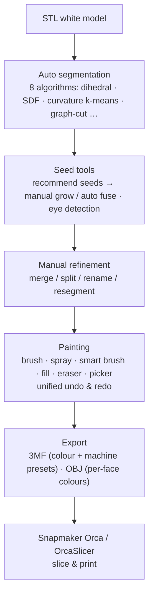
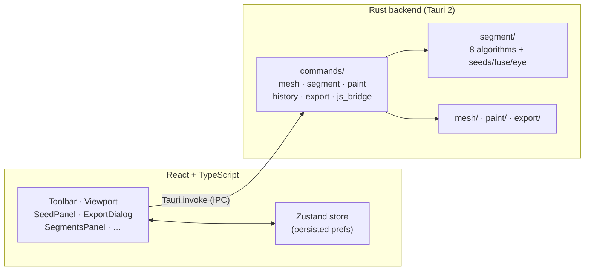

# ColorYourModel 🎨

[English](README.md) | [简体中文](README.zh-CN.md)

> Turn white-model STLs into region-based, multi-colour 3MFs ready for multi-material 3D printing.

[](LICENSE)


**ColorYourModel (CYM)** is a desktop app (Tauri 2 + React + Three.js frontend, Rust backend) that solves a practical 3D-printing problem: white-model STL files are just a pile of unstructured triangles — no "regions", no colour. Painting such a model triangle-by-triangle in a slicer is hopeless for anything detailed.

CYM automatically segments the mesh into semantic regions (helmet, skin, base…), lets you refine and paint them with region-aware tools, and exports a standards-compliant **3MF with per-region colours** that imports into Snapmaker Orca / OrcaSlicer as real filament assignments — verified end-to-end on real hardware (Aug 2026, Snapmaker U1).



## Features

### Working today ✅

- **STL import** — binary + ASCII, ~4 s for 1.5M-face-class models, with progress events
- **Auto segmentation v2** — one unified backend interface (`SegmentationAlgorithm`) with 8 algorithms: dihedral split, shape-diameter SDF, curvature k-means, SDF graph-cut, concavity, convex decomposition, curve skeleton, FH graph. The UI panel exposes 3 of them with tunable, persisted parameters
- **Seed-based segmentation** — recommended seeds (planar / multiview / cross-section / saliency), point-by-point manual grow, and auto fuse with tiny-region merging
- **Eye-region detection** — one-click detection for figure models, global (no ROI needed)
- **Region management** — merge / split / rename regions, resegment a single region
- **Paint tools** — brush, spray, smart brush (region-boundary aware), fill, eraser, colour picker
- **Label-authority fill** — fill targets strictly the region you clicked, so two regions can safely share the same colour (regression-tested)
- **Unified undo / redo** — one timeline covering paint, fill, erase and manual edits
- **Segment view** — region-coloured visualization with boundary outlines; hover highlight is a GPU shader (per-vertex label attribute, O(1) switch, on-demand rendering)
- **BVH face picking** — `three-mesh-bvh` accelerated CPU raycasting; stable hits on 1.5M-face meshes
- **Export 3MF** — verified end-to-end (2026-08): multi-filament colours import correctly into Snapmaker Orca; embedded machine preset makes the slicer show *Snapmaker U1 (0.4 nozzle)* out of the box. Export dialog: machine → nozzle → process → filament slots → target slicer, with multi-region selection and apply-all
- **Export OBJ** — per-face colours via MTL material groups, quantized to at most 256 colours
- **Ergonomics** — 3D brush-cursor ring, Space-to-pan, progress bars, crash diagnostics (JS error bridge)
- **i18n** — Chinese (default) and English UI, choice persisted

### Planned 🗓

- [ ] Colour palette presets + colour history
- [ ] Batch processing of similar models
- [ ] OrcaSlicer plugin-form integration

## Tech stack

| Layer | Tech | Notes |
|-------|------|-------|
| Frontend | React 18 + TypeScript | declarative UI |
| 3D | Three.js + @react-three/fiber + three-mesh-bvh | rendering + accelerated picking |
| State | Zustand (persist) | app state + preferences |
| Desktop | Tauri 2 | native window + Rust backend |
| Backend | Rust | mesh I/O, segmentation, painting, export |
| Rust crates | nalgebra · parry3d · petgraph · kiddo · stl_io · quick-xml · zip | geometry, graphs, spatial index, parsing |
| Build/Test | Vite 6 · Vitest + Testing Library · cargo test | `tsc --noEmit` / `vitest run` / `cargo test --lib` |

### Architecture



## Project structure

```
ColorYourModel/
├── src/                          # React frontend (TypeScript)
│   ├── components/
│   │   ├── Toolbar/              # tool selection + parameters
│   │   ├── Viewport/             # 3D viewport (BVH picking, shader highlight)
│   │   ├── BrushSettings/        # brush parameters
│   │   ├── ColorPanel/           # colour selection
│   │   ├── SegmentsPanel/        # region management
│   │   ├── StatusBar/            # status + HUD diagnostics
│   │   ├── ExportDialog/         # 3MF export wizard (presets)
│   │   ├── SeedPanel.tsx         # seed segmentation: Auto (fuse) / Manual (grow)
│   │   ├── IntelligentSegmentPanel.tsx  # auto-segmentation algorithms + params
│   │   └── DebugLogViewer.tsx    # in-app crash diagnostics
│   ├── hooks/                    # useMesh · usePaintTool · useTauriCommand · useHistory
│   ├── store/appStore.ts         # Zustand global state (persisted)
│   ├── types/                    # mesh · segment · export types
│   ├── utils/                    # logger · segment palette
│   ├── i18n.ts                   # zh (default) / en
│   ├── App.tsx · main.tsx
├── src-tauri/                    # Rust backend
│   ├── src/
│   │   ├── commands/             # Tauri IPC layer (mesh/segment/paint/history/export)
│   │   ├── mesh/                 # STL loader · model + adjacency · kdtree
│   │   ├── segment/              # segmentation algorithms, seeds, fuse, eye detection
│   │   ├── paint/                # brush · spray · fill · smart snap · eraser
│   │   ├── export/               # 3MF · OBJ · slicer presets · quantize
│   │   └── lib.rs                # Tauri builder + command registry
│   ├── resources/presets/        # generated slicer presets (from OrcaSlicer vendor tree)
│   └── Cargo.toml
├── docs/                         # see docs/README.md for the index
├── tools/                        # preset extraction & 3MF/fill verification scripts
├── examples/                     # sample output (paint_color_sample.3mf)
├── legacy/                       # deprecated Python prototype
└── CHANGELOG.md
```

## Getting started

### Prerequisites

- [Node.js](https://nodejs.org/) ≥ 18
- [Rust](https://www.rust-lang.org/tools/install) ≥ 1.70 + Cargo
- [Tauri 2 prerequisites](https://v2.tauri.app/start/prerequisites/) (WebView2 etc.)

### Run

```bash
git clone https://github.com/ZackaryShen/ColorYourModel.git
cd ColorYourModel

npm install
npm run tauri dev      # first run compiles the Rust backend (~2-3 min)
```

### Tests & checks

```bash
npx tsc --noEmit               # TypeScript
npx vitest run                 # frontend unit tests
cd src-tauri && cargo test --lib   # backend unit + regression tests
```

### Debug logging

```bash
# Windows PowerShell
$env:RUST_LOG="debug"; npm run tauri dev

# Linux / macOS
RUST_LOG=debug npm run tauri dev
```

## Documentation

See [docs/README.md](docs/README.md) for the full index. Short version:

- [docs/algorithms/](docs/algorithms/) — segmentation & detection algorithms (math and principles)
- [docs/technical/](docs/technical/) — engineering mechanisms (picking, highlight, undo/redo, export pipeline)
- [docs/cases/](docs/cases/) — case showcase & verification records
- `docs/01…10-*.md` — Chinese working documents (PRD, architecture, defects, roadmap, research notes)
- [CHANGELOG.md](CHANGELOG.md) — per-iteration changelog

The project is developed with an adversarial development loop (`PLAN → REFUTE → REVISE → IMPLEMENT → TEST → RETROSPECT`); see the CHANGELOG for per-round records.

## Roadmap

> No release tags yet. Status is measured against PRD acceptance criteria, not "code exists".

- [x] **v0.1 core loop** — STL import → segmentation → painting → verified 3MF export (Aug 2026)
  - 3MF export verified end-to-end on Snapmaker Orca (U1); fill routing regression-tested
  - Remaining: real-machine re-verification of the fill cluster (see [docs/04](docs/04-缺陷与遗留问题清单.md))
- [ ] **v0.2** — palette presets + colour history, UX polish
- [ ] **v1.0** — batch processing, OrcaSlicer plugin-form integration

## Contributing

Issues and PRs welcome. Please follow [Conventional Commits](https://www.conventionalcommits.org/). By contributing you agree that your contributions are licensed under AGPL-3.0.

## License

This project is licensed under the [GNU AGPL-3.0](LICENSE).

Copyleft keeps derivatives — including network-service deployments — open under the same terms, while every person and company remains free to use, study, modify and redistribute the software. Note: the bundled slicer presets are extracted from the OrcaSlicer (AGPL-3.0) vendor tree and are treated as AGPL-derived data. For alternative licensing, contact the maintainer.
