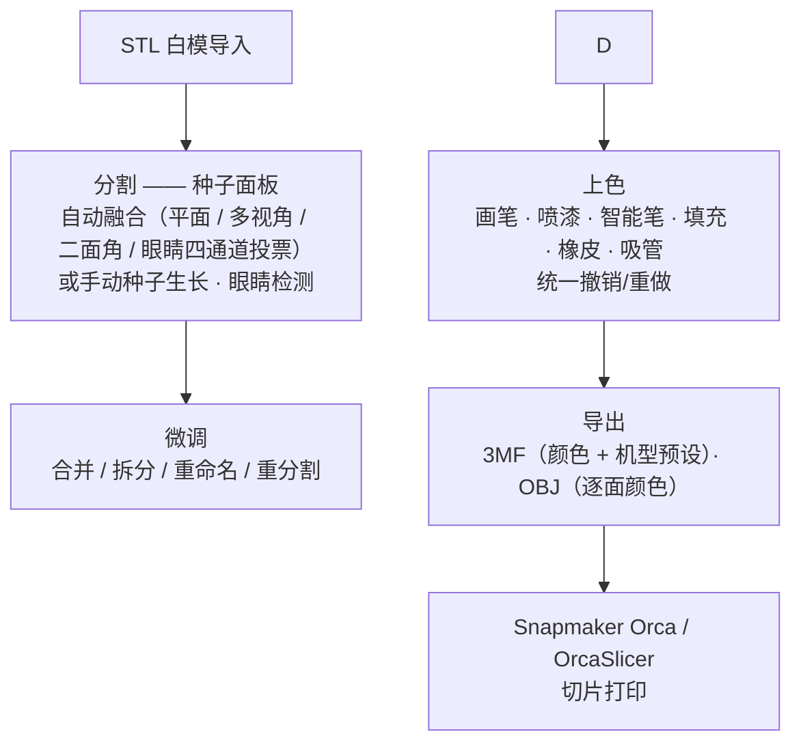
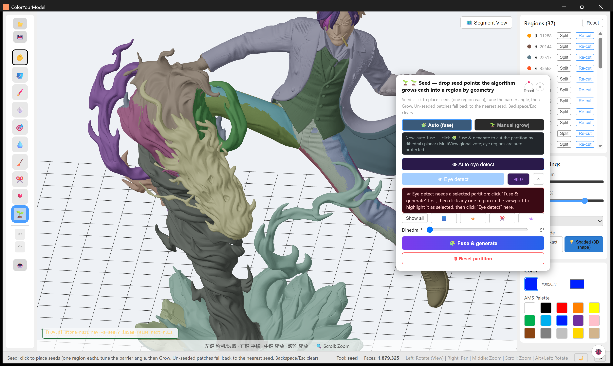
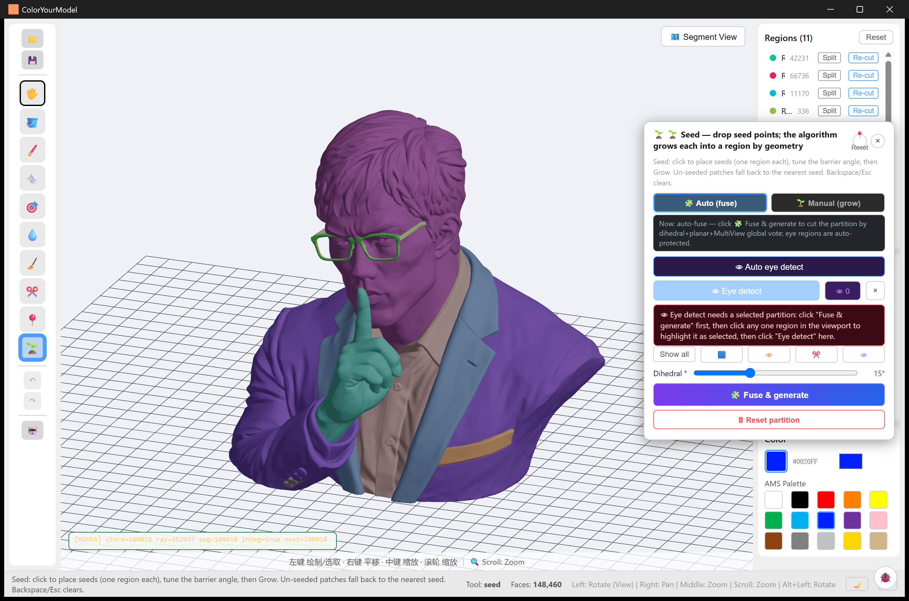
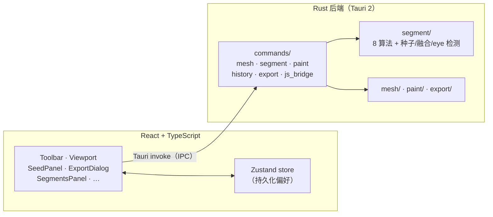

# ColorYourModel 🎨

[English](README.md) | [简体中文](README.zh-CN.md)

> 把 3D 打印白模 STL 变成基于分区的彩色 3MF，直接多耗材彩色打印。

[](LICENSE)


**ColorYourModel（CYM）** 是一款桌面应用（Tauri 2 + React + Three.js 前端，Rust 后端），解决一个实际的 3D 打印问题：白模 STL 只是一堆无结构的三角面片——没有"分区"概念，也没有颜色。高细节模型在切片软件里逐面片涂色基本不可行。

CYM 自动把网格分割成语义化区域（头盔、皮肤、底座……），提供分区感知的上色工具做微调，最终导出符合规范的**带逐分区颜色的 3MF**，在 Snapmaker Orca / OrcaSlicer 中导入即为真实的耗材分色——已在真机端到端验证（2026-08，Snapmaker U1）。



## 功能特性

### 当前可用 ✅

- **STL 导入**——二进制 + ASCII，1.5M 面级模型约 4 秒加载，带进度事件
- **分割**——种子面板一键**融合**（平面 / 多视角 / 二面角 / 眼睛四通道投票）或手动种子生长；8 种可互换算法收于同一后端接口，经分区面板的「重分割」按区域选用。导入**不做**自动分割——分区生成是显式步骤
- **种子分区**——推荐种子（平面 / 多视角 / 截面 / 显著性）、逐点手动生长、自动融合 + 小分区合并
- **眼睛区域检测**——手办模型一键识别，全局检测（无需 ROI）
- **分区管理**——合并 / 拆分 / 重命名分区，单区域重分割
- **上色工具**——画笔、喷漆、智能笔（分区边界感知）、填充、橡皮、吸管
- **标签权威填充**——填充严格作用于点击面所属分区，两个分区可安全共用同一颜色（有回归测试保护）
- **统一撤销 / 重做**——一条时间线覆盖画笔、填充、橡皮与手动编辑
- **分区视图**——分区彩色可视化 + 边界描边；hover 高亮为 GPU 着色器方案（逐顶点标签属性，O(1) 切换，按需渲染）
- **BVH 面拾取**——`three-mesh-bvh` 加速的 CPU 射线求交，1.5M 面模型稳定命中
- **3MF 导出**——已端到端验证（2026-08）：多耗材颜色正确导入 Snapmaker Orca；内嵌机型预设让切片器开箱即显示 *Snapmaker U1 (0.4 nozzle)*。导出对话框：机型 → 喷嘴 → 工艺 → 耗材槽位 → 目标切片器，支持多分区选择 + 一键套用
- **OBJ 导出**——经 MTL 材质分组实现逐面颜色，最多量化到 256 色
- **交互细节**——3D 画笔光标环、Space 平移、进度条、崩溃诊断（JS 错误桥接）
- **i18n**——中文（默认）/ 英文界面，选择持久化

### 计划中 🗓

- [ ] 调色板预设 + 颜色历史
- [ ] 同类模型批量处理
- [ ] OrcaSlicer 插件形态集成

## 截图

| | |
|---|---|
|  |  |
| 187 万面手办 → 37 区，可逐部件上色 | 上色胸像——3MF 端到端验证用的就是这个模型 |

十三个真实案例——手办、AI 生成模型、招牌、建筑件——见[**示例图库**](docs/bak/cases/examples.md)。

## 技术栈

| 层级 | 技术 | 说明 |
|------|------|------|
| 前端 | React 18 + TypeScript | 声明式 UI |
| 3D | Three.js + @react-three/fiber + three-mesh-bvh | 渲染 + 加速拾取 |
| 状态 | Zustand（persist） | 应用状态 + 偏好持久化 |
| 桌面 | Tauri 2 | 原生窗口 + Rust 后端 |
| 后端 | Rust | 网格 I/O、分割、上色、导出 |
| Rust 依赖 | nalgebra · parry3d · petgraph · kiddo · stl_io · quick-xml · zip | 几何、图、空间索引、解析 |
| 构建/测试 | Vite 6 · Vitest + Testing Library · cargo test | `tsc --noEmit` / `vitest run` / `cargo test --lib` |

### 架构示意



## 项目结构

```
ColorYourModel/
├── src/                          # React 前端 (TypeScript)
│   ├── components/
│   │   ├── Toolbar/              # 工具选择 + 参数
│   │   ├── Viewport/             # 3D 视口（BVH 拾取、着色器高亮）
│   │   ├── BrushSettings/        # 画笔参数
│   │   ├── ColorPanel/           # 颜色选择
│   │   ├── SegmentsPanel/        # 分区管理
│   │   ├── StatusBar/            # 状态栏 + HUD 诊断
│   │   ├── ExportDialog/         # 3MF 导出向导（预设库）
│   │   ├── SeedPanel.tsx         # 种子分区：Auto（融合）/ Manual（生长）
│   │   ├── IntelligentSegmentPanel.tsx  # 自动分割算法 + 参数
│   │   └── DebugLogViewer.tsx    # 应用内崩溃诊断
│   ├── hooks/                    # useMesh · usePaintTool · useTauriCommand · useHistory
│   ├── store/appStore.ts         # Zustand 全局状态（持久化）
│   ├── types/                    # mesh · segment · export 类型
│   ├── utils/                    # 日志 · 分区调色板
│   ├── i18n.ts                   # 中文（默认）/ 英文
│   ├── App.tsx · main.tsx
├── src-tauri/                    # Rust 后端
│   ├── src/
│   │   ├── commands/             # Tauri IPC 层（mesh/segment/paint/history/export）
│   │   ├── mesh/                 # STL 加载 · 模型 + 邻接图 · kdtree
│   │   ├── segment/              # 分割算法、种子、融合、eye 检测
│   │   ├── paint/                # brush · spray · fill · smart snap · eraser
│   │   ├── export/               # 3MF · OBJ · 切片器预设 · 量化
│   │   └── lib.rs                # Tauri Builder + 命令注册
│   ├── resources/presets/        # 生成的切片器预设（源自 OrcaSlicer vendor 树）
│   └── Cargo.toml
├── docs/                         # HTML 文档（可编辑 md 源在 docs/bak/）
├── tools/                        # 预设萃取与 3MF/fill 验证脚本
├── examples/                     # 示例产物（paint_color_sample.3mf）
├── legacy/                       # 已废弃的 Python 原型
└── CHANGELOG.md
```

## 快速开始

### 环境要求

- [Node.js](https://nodejs.org/) ≥ 18
- [Rust](https://www.rust-lang.org/tools/install) ≥ 1.70 + Cargo
- [Tauri 2 系统依赖](https://v2.tauri.app/start/prerequisites/)（WebView2 等）

### 运行

```bash
git clone https://github.com/ZackaryShen/ColorYourModel.git
cd ColorYourModel

npm install
npm run tauri dev      # 首次启动编译 Rust 后端（约 2-3 分钟）
```

### 测试与检查

```bash
npx tsc --noEmit               # TypeScript
npx vitest run                 # 前端单测
cd src-tauri && cargo test --lib   # 后端单测 + 回归测试
```

### 调试日志

```bash
# Windows PowerShell
$env:RUST_LOG="debug"; npm run tauri dev

# Linux / macOS
RUST_LOG=debug npm run tauri dev
```

## 文档

Markdown 源文件在 [`docs/bak/`](docs/bak/README.md)（与 docs 树镜像）；由它生成的 HTML 存档是正式的可读文档——本地双击任意 `*.html` 即可浏览，完整索引见 [docs/bak/README.md](docs/bak/README.md)。简版：

- [docs/algorithms/](docs/bak/algorithms/) —— 分割与检测算法（数学原理）
- [docs/technical/](docs/bak/technical/) —— 工程机制（拾取、高亮、撤销/重做、导出管线）
- [docs/cases/](docs/bak/cases/) —— 案例展示与验证记录
- `docs/bak/01…10-*.md` —— 中文工作文档（PRD、架构、缺陷清单、路线图、研究笔记）
- [CHANGELOG.md](CHANGELOG.md) —— 逐迭代变更记录

本项目采用对抗式自循环开发（`PLAN → REFUTE → REVISE → IMPLEMENT → TEST → RETROSPECT`），各轮记录见 CHANGELOG。

## 路线图

> 尚无 release tag。状态以 PRD 验收标准衡量，不以"代码写完"衡量。

- [x] **v0.1 核心闭环** —— STL 导入 → 分割 → 上色 → 已验证的 3MF 导出（2026-08）
  - 3MF 已在 Snapmaker Orca (U1) 端到端验证；fill 路由有回归测试保护
  - 待办：fill 簇真机复验（见 [docs/04](docs/bak/04-缺陷与遗留问题清单.md)）
- [ ] **v0.2** —— 调色板预设 + 颜色历史、体验打磨
- [ ] **v1.0** —— 批量处理、OrcaSlicer 插件形态集成

## 贡献

欢迎 Issue 和 PR——构建方式、测试命令与文档流程见 [CONTRIBUTING.md](CONTRIBUTING.md)。请遵循 [Conventional Commits](https://www.conventionalcommits.org/)。提交即表示同意贡献内容按 AGPL-3.0 授权。

## 许可证

本项目基于 [GNU AGPL-3.0](LICENSE) 授权。

Copyleft 保证衍生作品——包括网络服务形态——同样开源，同时任何人（含公司）都可自由使用、学习、修改和再分发。注：内置切片器预设萃取自 OrcaSlicer（AGPL-3.0）vendor 树，按 AGPL 派生数据处理。如需替代授权，请联系维护者。
