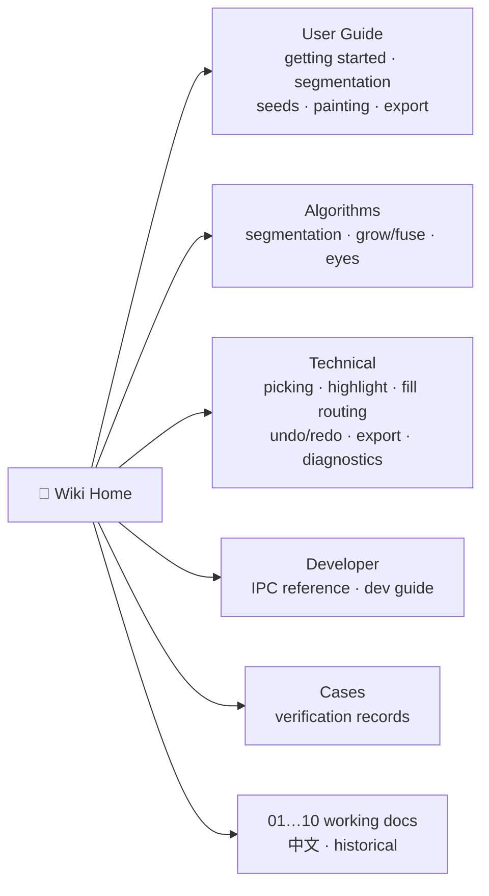

# ColorYourModel Wiki

This is the documentation hub for **ColorYourModel (CYM)** — a desktop app that turns white-model STLs into region-based, multi-colour 3MFs for multi-material 3D printing. When any document disagrees with the code, **the source code is the authority**.

Every page has a colocated HTML archive (`X.md` → `X.html`) committed next to it — the markdown is the editable source; after editing run `npm run docs:build`.

## I want to…

| Goal | Page |
|------|------|
| Build and run the app for the first time | [Getting Started](user-guide/getting-started.md) |
| Understand / tune automatic segmentation | [Auto Segmentation](user-guide/auto-segmentation.md) |
| Refine a figure model (seeds, grow, fuse, eyes) | [Seed Tools](user-guide/seed-tools.md) |
| Paint, fill, undo, navigate | [Painting Tools](user-guide/painting-tools.md) |
| Get a multi-colour printable file | [Exporting](user-guide/exporting.md) |
| Know every Tauri command and signature | [IPC Reference](developer/ipc-reference.md) |
| Contribute code or docs | [Development Guide](developer/development.md) |
| See a real end-to-end result | [3MF verification case](cases/01-3mf-end-to-end.md) |
| Read how an algorithm works inside | [Algorithms](algorithms/README.md) |

## Document map

| Kind | Where | Language |
|------|-------|----------|
| User guide | [`user-guide/`](user-guide/getting-started.md) | EN |
| Algorithms (math & principles) | [`algorithms/`](algorithms/README.md) | EN skeleton · EN/中文 content |
| Engineering mechanisms | [`technical/`](technical/README.md) | EN skeleton · EN/中文 content |
| Cases & verification records | [`cases/`](cases/README.md) | EN/中文 |
| Developer reference | [`developer/`](developer/ipc-reference.md) | EN |
| Numbered working documents | `01…10-*.md` | 中文 |
| Iteration journal | [`loop-journal.md`](loop-journal.md) | 中文 |

## Numbered series (working documents, 中文)

| # | Document | Content |
|---|----------|---------|
| 01 | [PRD](01-PRD-ColorYourModel.md) | product requirements & acceptance criteria |
| 02 | [技术架构说明书](02-技术架构说明书.md) | technical architecture |
| 03 | [迭代复盘与工程经验沉淀](03-迭代复盘与工程经验沉淀.md) | iteration retrospectives |
| 04 | [缺陷与遗留问题清单](04-缺陷与遗留问题清单.md) | defect tracker (P0/P1/P2 with evidence) |
| 05 | [v0.1 路线图 backlog](05-v0.1-路线图-backlog-2026-08-06.md) | roadmap & backlog |
| 06 | [v0.1 开发路线图](06-v0.1-开发路线图.md) | development roadmap |
| 07 | [智能分区设计](07-智能分区设计.md) | smart segmentation design |
| 08 | [智能分区-算法参考与论文](08-智能分区-算法参考与论文.md) | algorithm references & papers |
| 09 | [连续平面与边界-算法融合研究](09-连续平面与边界-算法融合研究.md) | plane/boundary fusion research |
| 10 | [眼睛区域语义识别](10-眼睛区域语义识别.md) | eye-region detection research |

> Note: 07/08/09/10 are historical research records. For current behaviour, read the code (`src-tauri/src/segment/`) and the wiki pages under `algorithms/`.
