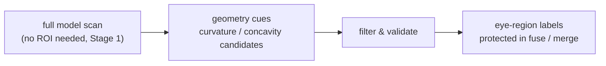

# Eye-Region Semantic Detection

> Status: **placeholder** — content pending. Fill freely in English or 中文.

## Scope

Automatic detection of eye regions on figure/character models, used as protected seeds:

Topics to cover: global detection (`detect_eye_regions_auto`), ROI-parameterized detection
(`detect_eye_regions`) with tunable thresholds, and why eyes matter — small, high-curvature,
visually critical regions where bad segmentation ruins a figure print.

## Code pointers

- `src-tauri/src/segment/template.rs` — global detection backend
- `src-tauri/src/segment/eye.rs` — eye-region primitives
- `src-tauri/src/commands/segment.rs` — `detect_eye_regions` / `detect_eye_regions_auto`
- `src/components/SeedPanel.tsx` — "detect eyes" entry

## Related research notes (中文, historical)

- `../10-眼睛区域语义识别.md` — research record (pre-Stage-1; read code for current behaviour)

## TODO

- [ ] Detection pipeline (curvature/geometry cues → candidates → filtering)
- [ ] Threshold table with provenance
- [ ] Failure cases & how to recover manually
