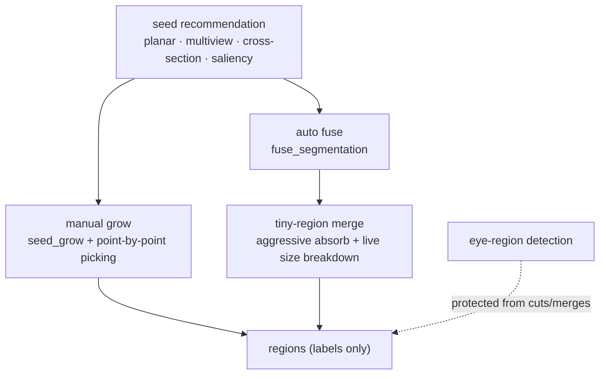

# Seed-Based Segmentation: Grow & Fuse

> Status: **placeholder** — content pending. Fill freely in English or 中文.

## Scope

The seed-driven segmentation workflow exposed in `SeedPanel` (Auto = fuse / Manual = grow):

Topics to cover: seed recommendation sources, manual grow mechanics, auto fuse with
tiny-region merging (including the reverse-split behaviour and the live region-size
breakdown), and why eye regions survive fuse/merge passes.

## Code pointers

- `src-tauri/src/segment/seeded.rs` · `fuse.rs` · `manual.rs` · `recommend.rs`
- `src-tauri/src/segment/{planar,multiview,cross_section}.rs`
- `src/components/SeedPanel.tsx` (Auto/Manual modes)

## Related research notes (中文, historical)

- `../09-连续平面与边界-算法融合研究.md` — plane/boundary fusion research

## TODO

- [ ] Grow barrier-angle semantics (what the slider really does)
- [ ] Fuse/tiny-merge thresholds with provenance
- [ ] Region-authority note: algorithms propagate labels, never colours (see [../technical/fill-routing.md](../technical/fill-routing.md))
