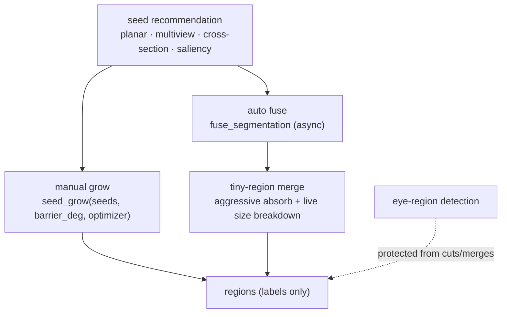

# Seed-Based Segmentation: Grow & Fuse

> Seed-driven refinement for figure-type models. Status: **v1 written from verified sources**.
> Usage guide: [User Guide: Seed Tools](../user-guide/seed-tools.md).

## The flow

## Seeded watershed growth

`seed_grow` takes placed seeds (`SeedInput`: snapped 3D point + hit face), a **barrier angle** and an **optimizer** flag. Growth spreads from each seed across the face graph and stops where the normal deviation exceeds the barrier — the seeded watershed model dates from iteration 50. The optimizer post-pass tightens the grown boundaries.

TODO: exact watershed scoring function and the barrier measurement definition (dihedral vs. normal-to-seed).

## Seed recommendation

- `recommend_seeds(count, curvature, concavity)` — saliency-weighted suggestions; the two weights are the panel's *curvature* / *concavity* sliders.
- Structured detectors, each with its own parameters (see [IPC Reference](../developer/ipc-reference.md) for signatures):
  - **Planar regions** — `detect_planar_regions(angle_threshold_deg, dist_thr_factor, min_region_faces)`
  - **Multiview** — `detect_multiview_regions(view_count, angle_threshold_deg, min_region_faces, match_threshold)`
  - **Cross-section** — `detect_cross_section_features(planes_per_axis, feature_threshold)`

## Fuse & tiny-region merge

`fuse_segmentation` (async) consolidates over-seeded output:

- **Aggressive tiny-region merging** — micro-regions are absorbed so the result stays printable; a **live breakdown** of region sizes streams to the status area while it runs (iteration 80).
- **Cut threshold 2** — the merged-graph guard was hardened against pathological inputs (`b543ede`, "bulletproof tiny-region merge").
- **Reverse-split** — a merge that would destroy structure can be reversed; the fuse-debug tooling from iteration 80's journal came out of exactly that failure mode.

## Eye-region protection

Once eye regions are detected they are **protected**: internal dihedral cuts skip them (`2fc242a`) and fuse/merge passes keep them intact — a merged-away eye is a ruined figure print.

## Invariants

- All of the above propagate **labels only**. Overwriting `face_colors` with palette colours during fuse/grow is a known violation being tracked (tracker §8, pending the 3MF colour-strategy ruling) — see [Fill Routing](../technical/fill-routing.md).

## Related research (中文, historical)

[`09-连续平面与边界-算法融合研究`](../09-连续平面与边界-算法融合研究.md)
