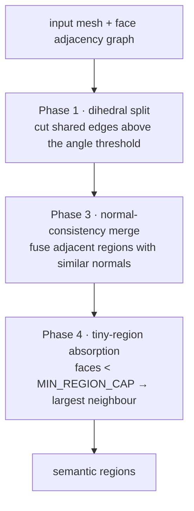
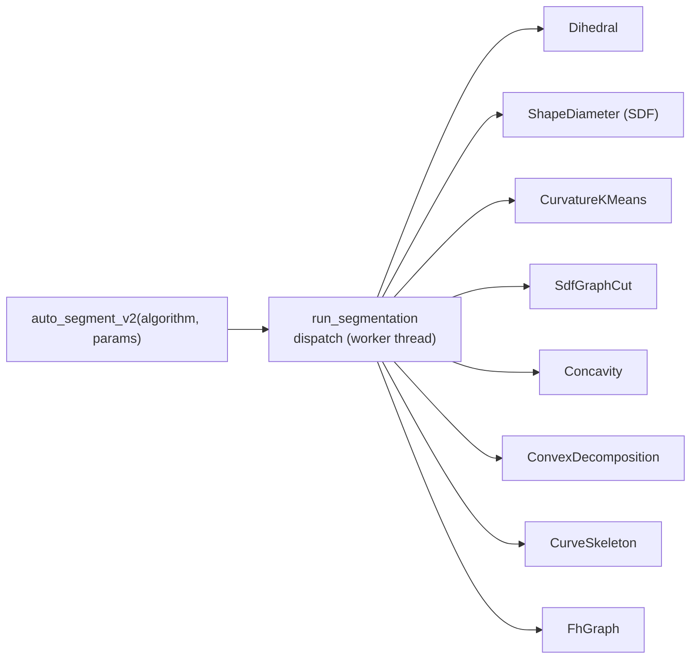

# Mesh Segmentation

> How CYM partitions a mesh into semantic regions. Status: **v1 written from verified sources**; formula deep-dives are marked TODO.
> Usage guide: [User Guide: Auto Segmentation](../user-guide/auto-segmentation.md).

## Layer 1 — three-phase dihedral pipeline

The original `auto_segment` (still the on-import default, dihedral 30°):

- **Phase 1 — dihedral split**: every shared edge whose dihedral angle exceeds the threshold (default **30°**, `DEFAULT_DIHEDRAL_ANGLE`) breaks — hard edges become region borders.
- **Phase 3 — normal-consistency merge**: adjacent regions whose normals agree are merged iteratively until convergence, undoing over-splitting on curved surfaces.
- **Phase 4 — tiny-region absorption**: regions below `MIN_REGION_CAP = 30` faces merge into their largest neighbour. History: the cap was once 500, which collapsed a 1.5M-face model into 27 regions — 30 is the current tuned value (provenance: iteration 6 retrospective; adaptive sizing is an open item, tracker P1-2).

Manual regions live in a disjoint label space (`MANUAL_SEGMENT_OFFSET = 100_000`) so re-running auto segmentation never overwrites hand-drawn regions.

## Layer 2 — v2 unified interface

`auto_segment_v2` dispatches through one interface (`SegmentationAlgorithm`, `run_segmentation` in `segment/mod.rs`), **async on a worker thread** so the UI never blocks on the mesh lock:

| Variant | Parameters (default) | UI panel |
|---------|----------------------|----------|
| `dihedral` | angleThreshold (30°) | ✅ |
| `shapeDiameter` | k (0 = auto) | ✅ |
| `curvatureKMeans` | k (6), smoothingIters (2), useSdf (true), creaseThresholdDeg (45°) | ✅ |
| `sdfGraphCut` | k (0) | — |
| `concavity` | k (0) | — |
| `convexDecomposition` | maxHulls (0), concavity (5) | — |
| `curveSkeleton` | maxHulls (0), concavity (5) | — |
| `fhGraph` | scale (0.3), curvature (1.0), concavity (1.0) | — |

Single-region resegmentation reuses the same interface (`resegment_region`).

## Correctness guardrails

- **Golden topology tests** — cube → 6 regions, sphere → 1, double sphere → 2; 74 assertions passed at introduction (`b087c3c`).
- **Coincident-axis hardening** — UV-sphere-style inputs (hundreds of vertices sharing an axis coordinate) once panicked the kdtree; deterministic per-index perturbation fixed it with regression test `kdtree_coincident_axis_no_panic` (`69a17ea`).
- **Labels, not colours** — segmentation produces and propagates labels; colour is strictly output (see [Fill Routing](../technical/fill-routing.md)).

## Historical research records (中文)

[`07-智能分区设计`](../07-智能分区设计.md) · [`08-智能分区-算法参考与论文`](../08-智能分区-算法参考与论文.md) — note: written before Stage-1 landed; where they disagree with code, **code wins** (e.g. multiview *is* implemented).

## TODO

- [ ] Per-algorithm formula sections (k-means feature space, SDF definition, graph-cut energy)
- [ ] Provenance for curvature/SDF defaults (currently v1 defaults)
- [ ] Adaptive MIN_REGION_CAP by model scale (tracker P1-2)
