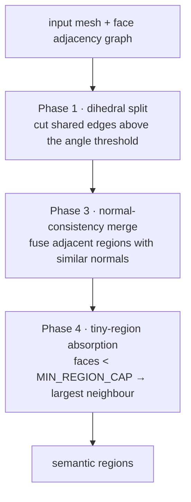
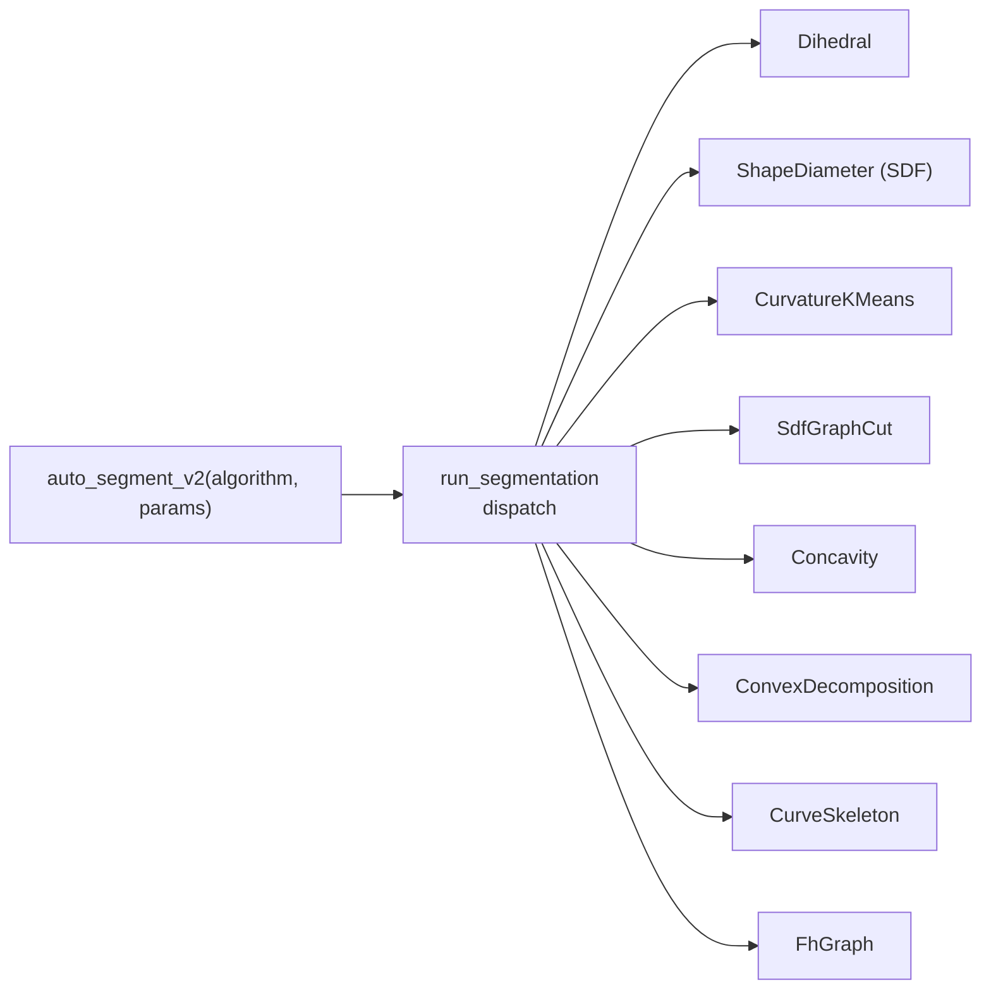

# Mesh Segmentation

> Status: **placeholder** — content pending. Scope is fixed below; fill freely in English or 中文.

## Scope

The full segmentation story, in two layers:

1. **Three-phase dihedral pipeline** (the original `auto_segment`):

2. **v2 unified interface** (`SegmentationAlgorithm`, `run_segmentation`): 8 registered algorithms,
   of which 3 are exposed in the UI panel (`IntelligentSegmentPanel`) with tunable, persisted parameters:

Also cover: manual label space separation (`MANUAL_SEGMENT_OFFSET = 100,000`),
region merge/split/rename/resegment operations, and the tiny-region merge diagnostics.

## Code pointers

- `src-tauri/src/segment/mod.rs` — `SegmentationAlgorithm` enum + dispatch
- `src-tauri/src/segment/dihedral.rs` — three-phase pipeline
- `src-tauri/src/segment/{curvature,sdf,concavity,convex_decomp,fh,graphcut}.rs`
- `src/components/IntelligentSegmentPanel.tsx` — UI + persisted params

## Related research notes (中文, historical)

- `../07-智能分区设计.md` · `../08-智能分区-算法参考与论文.md`

## TODO

- [ ] Pipeline diagrams (Mermaid)
- [ ] Per-algorithm: input → output → parameters → when to use
- [ ] Parameter provenance (every threshold with its source)
- [ ] Golden-sample topology tests (cube→6, sphere→1, double-sphere→2) explained
