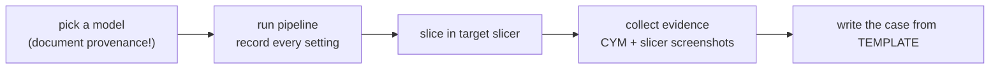

# Cases

Real models taken through the full CYM loop — segmentation, painting, export, sliced print — with evidence.

Status: **empty by design for now**; content is being written. Duplicate [`TEMPLATE.md`](TEMPLATE.md) per case.

For a visual tour first, see the [**Examples Gallery**](examples.md) — one page, thirteen real runs, every screenshot committed under `samples/`.

Provenance note (resolves the ⚠️ below): the models shown in the gallery and in case 01 were brought in by the repository authors to exercise the tools; CYM ships no models (only the verification screenshots are tracked), and all model artwork / trademarks remain the property of their respective owners.

Suggested next entries:

- [x] 3MF end-to-end verification (2026-08-27, Snapmaker Orca / U1) — written: [`01-3mf-end-to-end.md`](01-3mf-end-to-end.md) (provenance note above)
- [x] Examples gallery (2026-09-08) — written: [`examples.md`](examples.md), 13 models from sculpts to signage
- [ ] A figure model with eye detection + seed fuse
- [ ] A mechanical/planar model with auto segmentation only

## Why write cases down?

A case = a reproducible claim: which model, which settings, which slicer, what came out, where the evidence lives. It doubles as regression evidence when the pipeline changes.
