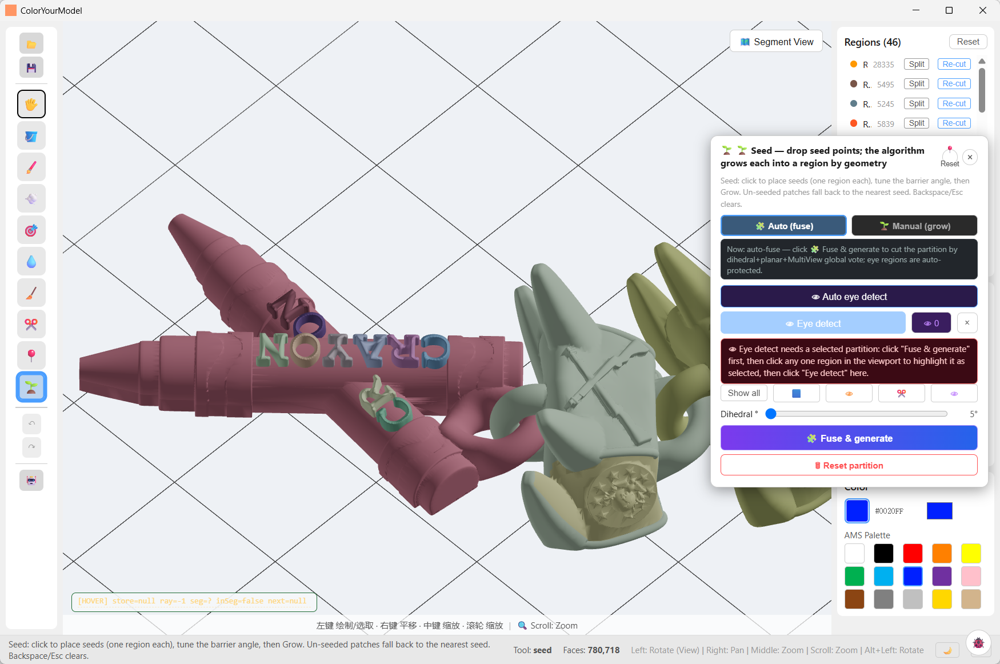
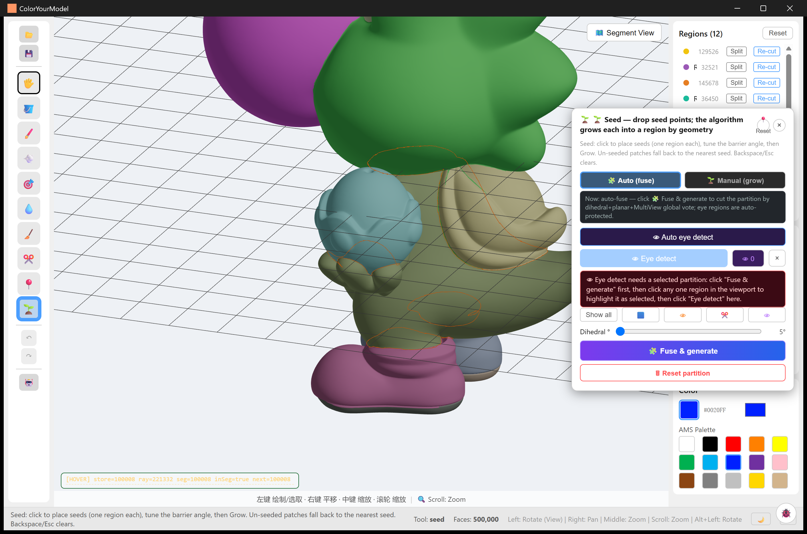
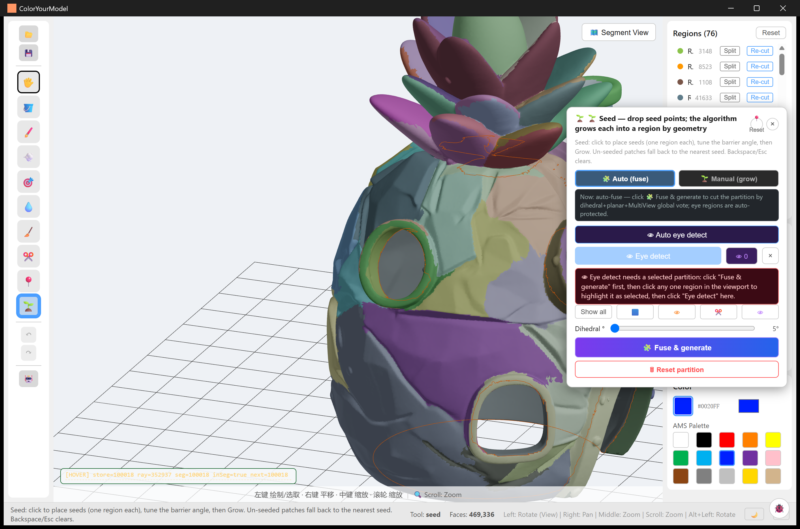
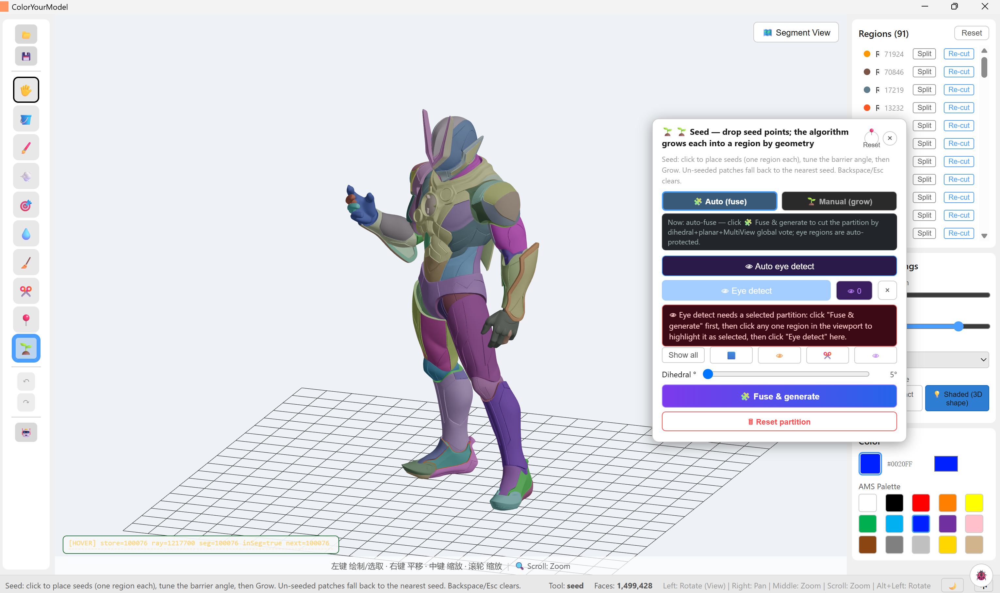
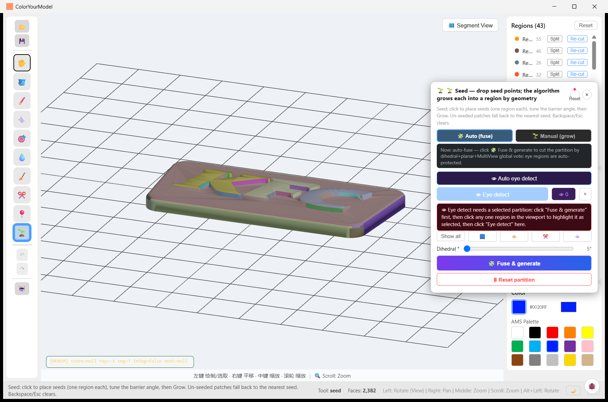
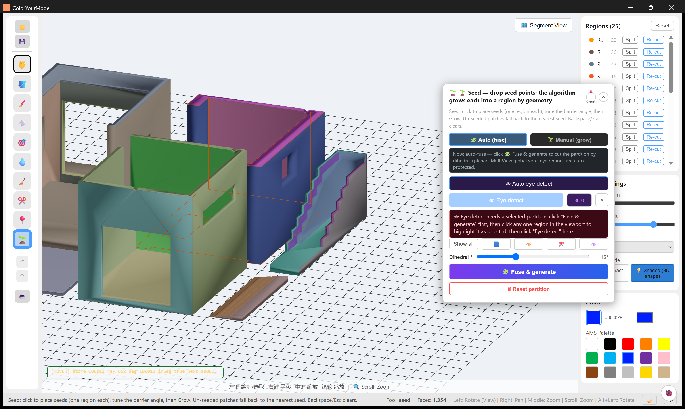

# Examples Gallery

> Real runs of CYM on user-collected models — what the segmentation sees, what
> the region panel looks like, and where a lasso stroke fits in. All screenshots
> are unretouched app captures committed under `samples/`.

**The workflow in every case**: import an STL → *Seed panel* → either
**Auto (fuse)** (one click; fold-angle + planar + multiview voting with eye
regions protected) or **Manual (grow)** (place seeds) → refine in the Regions
panel (split / re-cut / rename) → paint or fill → export a multi-colour 3MF.

**A note on the models**: every model shown was brought in by the authors of
this repository to exercise the tools. CYM ships **no models** — the STLs stay
on the author's machine and are not part of this repository (the repo tracks
only the verification screenshots). All model artwork, characters and
trademarks belong to their respective owners; if you redistribute screenshots
of your own runs, the same applies to them.

---

## Figure-class sculpts (the hard case)

Large, smoothly-sculpted figures are where region segmentation usually gives
up — one blob for the whole body. The fold-angle backbone of the fuse is tuned
for exactly this class: sculpted part folds spread their turning over many
sub-5° edges, so the dihedral slider goes down to **0°** (default **2°**), and
adjacent regions are always rendered in **different palette colours** so the
partition is readable at a glance.

**sanji-diorama** — 1,879,325 faces → 37 regions. Coat / waistcoat / trousers /
flame base separate cleanly; the region list on the right shows per-region face
counts with Split and Re-cut one click away.

**dragon** — armoured hero figure, 1,499,428 faces → 91 regions. Armour plates,
joints and body splits follow the sculpt's own folds; 91 regions stay
navigable because the panel sorts by size.

**single-color** — 500,000 faces → 12 regions. Deliberately coarse: the model
is a small palette of flat colour blocks, and the orange **lasso loop** shows a
hand-drawn region mid-stroke (lasso finalization now reports the same stage
progress bar as the fuse).

**liangsheng** — 148,460 faces → 11 regions. This is also the model of the
[end-to-end 3MF verification](01-3mf-end-to-end.md): the regions you see were
exported and imported into Snapmaker Orca as real filament assignments.

## AI-generated and imported meshes

**tripo-pineapple-house** — a Tripo-generated pineapple house, 469,336 faces →
76 regions. AI meshes arrive as one fused blob; the fuse recovers leaves,
windows and wall bands, and lasso strokes (orange) fix up what the vote missed.

**catastorm** — crayon sign with chain links, 780,718 faces → 46 regions.
Lettering and separate props come out as individual regions, ready for
per-letter colouring.

## Signage and architectural parts

Hard-surface models are the easy case: sharp creases cut themselves. These runs
sit at the higher end of the fold-angle slider (5–15°); the slider floor of 0°
exists for the sculpts above, not for these.

**kfc-sign** — 2,382 faces → 43 regions. Every letter of the signboard becomes
its own region — the classic multi-colour sign-printing use case. Sibling runs
`samples/kfc-kiosk/`, `samples/kfc-wall/`, `samples/kfc-frame/`,
`samples/kfc-counter2/` — same store, part by part (workflow shots: import /
segmentation / result).

**house2** — a two-room interior with furniture walls, 1,354 faces → 25 regions
at 15°. Rooms, door openings, stairs and floor trims each get their own region;
low-poly architectural meshes segment in well under a second.

## Also in the repository

`samples/chicken-coop/` — farmyard diorama workflow shots.

## Reproduce one of these

1. Import your STL (binary or ASCII).
2. Open the Seed panel, pick **Auto (fuse)** and press *Fuse & generate* —
   sculpted figures: leave the fold threshold near **2°**; hard-surface parts:
   raise it toward **10–15°**.
3. Refine in the Regions panel (Split / Re-cut), add hand-drawn regions with
   the **Lasso** where geometry has no boundary to offer.
4. Export → 3MF, pick machine / nozzle / filaments, open it in your slicer.

Details: [Seed Tools](../user-guide/seed-tools.md) ·
[Auto Segmentation](../user-guide/auto-segmentation.md) ·
[Exporting](../user-guide/exporting.md).
