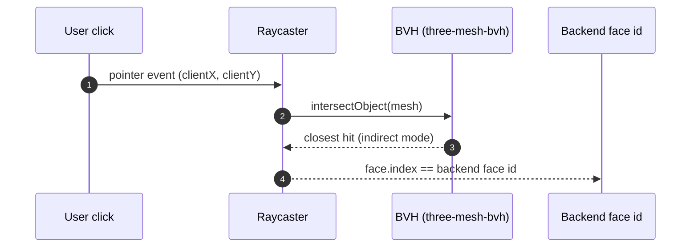

# BVH Face Picking

> Status: **placeholder** — content pending. Fill freely in English or 中文.

## Scope

How a mouse click becomes a face index on a 1.5M-face mesh:

Topics to cover: `three-mesh-bvh` build (`computeBoundsTree({ indirect: true })`, deferred to a
macrotask so the UI doesn't stall) and accelerated raycast; why CPU raycast and **not** GPU
render-target readback (FR-VIEW-07 forbids GPU readback — render-pipeline sync stalls; the old
colour-ID RenderTarget design is retired); face-index stability with shared position/index
buffers; hover + paint sharing ONE raycast per event (no double O(F) work).

## Code pointers

- `src/components/Viewport/Viewport.tsx` — BVH setup, picker hook, shared raycast
- `src/hooks/useMesh.ts` — geometry build & index ordering

## TODO

- [ ] Perf numbers (BVH build time / hit time per mesh size)
- [ ] DPR / coordinate correction notes
