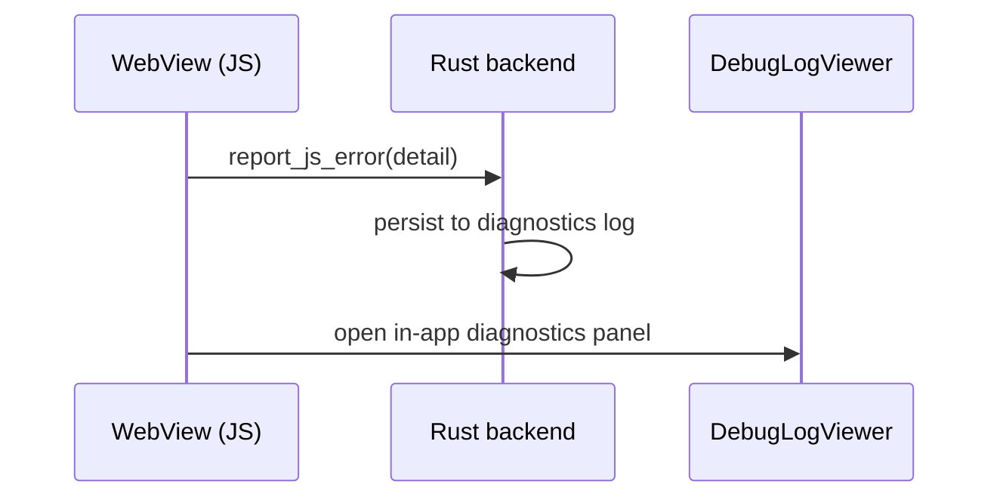

# Crash Diagnostics

> Status: **placeholder** — content pending. Fill freely in English or 中文.

## Scope

How frontend failures get captured and surfaced instead of dying silently:

Topics to cover: the `js_bridge` handshake (`report_js_error` / `report_app_ready`); in-app
`DebugLogViewer`; `RUST_LOG` backend logging; WebView2 gotchas on Windows (where console output
goes, how to attach devtools).

## Code pointers

- `src-tauri/src/commands/js_bridge.rs`
- `src/components/DebugLogViewer.tsx`
- `src/utils/logger.ts`

## TODO

- [ ] Diagnostic workflow: reproduce → capture → decode (with the 2026-08 crash case as example)
