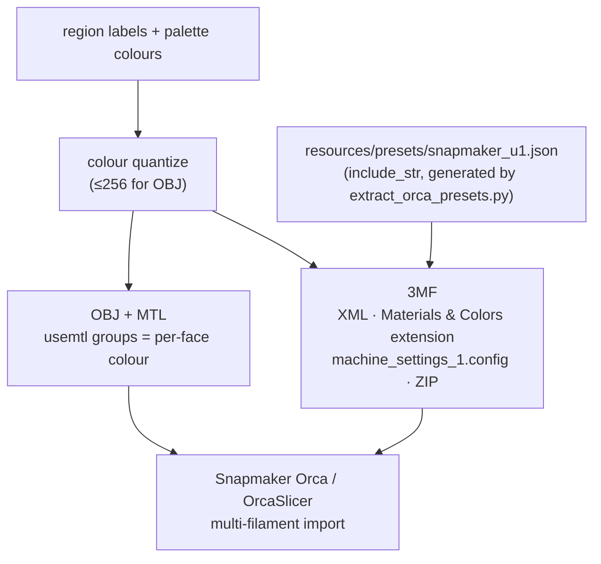

# Export Pipeline (3MF / OBJ / Presets)

> Status: **placeholder** — content pending. Fill freely in English or 中文.

## Scope

From painted labels to slicer-ready files:

Topics to cover: the 3MF XML anatomy (object/model, colour attributes, embedded machine settings
so slicers show *Snapmaker U1 (0.4 nozzle)* without vendor profiles installed); preset generation
(`tools/extract_orca_presets.py` — whitelisted vendors + `inherits` chain flattening, compiled in
via `include_str!`); the export dialog (machine → nozzle → process → filament slots → target
slicer, multi-region selection + apply-all, persisted last selection); OBJ per-face colours as
MTL groups quantized to ≤256 colours; verification record in `../04` P0-4 (Snapmaker Orca,
2026-08-27).

## Code pointers

- `src-tauri/src/export/{threemf,obj,presets,quantize,paint_color,project_config}.rs`
- `src-tauri/src/commands/export.rs`
- `src/components/ExportDialog/`
- `tools/extract_orca_presets.py` · `tools/verify_3mf.py`

## TODO

- [ ] 3MF XML anatomy (namespaces, colour attributes) with a real sample
- [ ] Quantization strategy (when 256 colours is / isn't enough)
- [ ] Preset regeneration workflow (`extract_orca_presets.py`)
