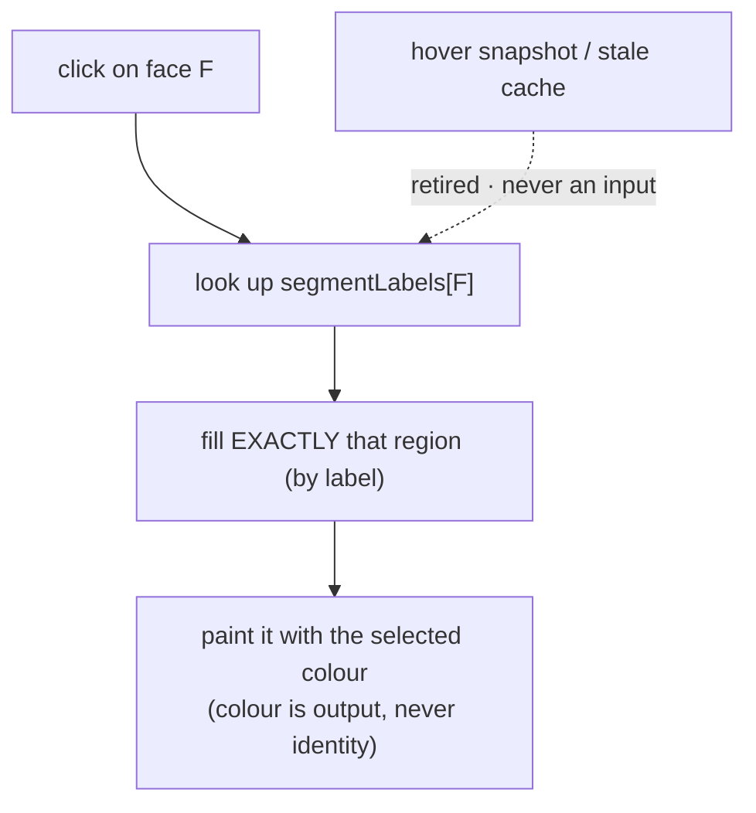

# Fill Routing: Label Authority

> Status: **placeholder** — content pending. Fill freely in English or 中文.

## Scope

The correctness rule that fixed the "fill C same colour → A changes" bug (`a7700df`, 2026-08-27):

Topics to cover: **labels are truth; colour is output** — fill targets strictly the region the
clicked face belongs to, so two regions can share one colour; the retired iter29 hover
preference and v5 stale cache (`lastValidHoveredSegmentRef`); regression guarantees in
`commands::paint::fill_tests` (same-colour double-region fill must not modify the first region;
Shift+click flood stops at label boundaries); where the rule generalizes (fuse/grow/lasso must
propagate labels, never overwrite `face_colors` — open backlog item, see `../04` §8).

## Code pointers

- `src-tauri/src/paint/fill.rs` — core fill + tests
- `src-tauri/src/commands/paint.rs` — `fill_paint` / `fill_segment_paint`
- `src/hooks/usePaintTool.ts` — frontend target routing

## TODO

- [ ] Decision record: why clicked-face label beats hover/memory heuristics
- [ ] Fuse/grow repaint ruling & the 3MF colour-strategy decision it depends on
