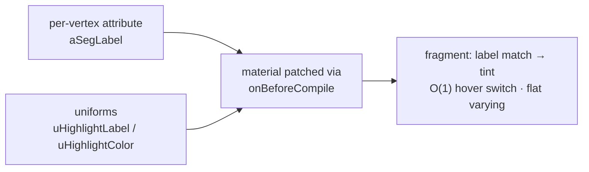

# Shader Segment Highlight

> Status: **placeholder** — content pending. Fill freely in English or 中文.

## Scope

The GPU highlight scheme (Plan B, iter. 2026-08-08) that replaced geometry-rebuilding overlays:

Topics to cover: O(1) hover switching (was O(F) geometry rebuild — the giant-segment freeze
root cause); `preserveDrawingBuffer` removed; conditional `frameloop="demand"` (`IdleFrameloop`:
sleep after 1.5 s idle, wake on interaction); tool-gated highlight (only fill / picker / segment
tools compute it).

## Code pointers

- `src/components/Viewport/Viewport.tsx` — material patch, uniform wiring, gating
- `src/segmentStages.ts`

## TODO

- [ ] Shader snippet walkthrough
- [ ] Why highlight is display-only (never a paint/fill input — see fill-routing.md)
