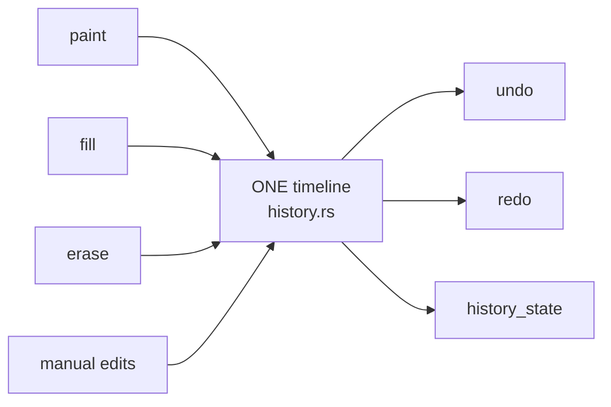

# Unified Undo / Redo Timeline

> Status: **placeholder** — content pending. Fill freely in English or 中文.

## Scope

The single backend history timeline (stage 2 consolidation):

Topics to cover: `undo` / `redo` / `history_state` covering paint, fill, eraser and manual
region edits; the deleted former `manual_region_undo` / `restore_face_colors` commands (no
parallel history paths); frontend `useHistory` wiring; how snapshots stay memory-bounded on
1.5M-face models.

## Code pointers

- `src-tauri/src/commands/history.rs` · `src-tauri/src/mesh/history.rs`
- `src/hooks/useHistory.ts`

## TODO

- [ ] Memory model per snapshot (what is stored, coalescing rules)
- [ ] Interaction with segmentation resets
