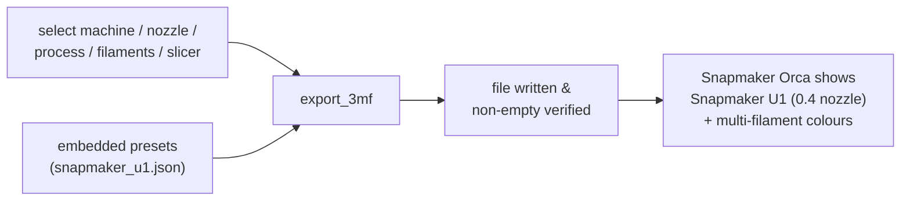

# Exporting

> Part of the CYM wiki — getting your coloured model into a slicer.
> Internals: [Technical: Export Pipeline](../technical/export-pipeline.md).

## Export 3MF (recommended)

The 3MF carries per-region colours **plus machine/process/filament metadata**, so the slicer shows a fully configured multi-material job.

The export dialog walks you through:

1. **Vendor & machine** — e.g. Snapmaker U1 (presets are embedded; no vendor profile installation needed)
2. **Nozzle diameter** — 0.2 / 0.4 / 0.6 / 0.8
3. **Process** — quality presets filtered for the machine + nozzle
4. **Filament slots** — one filament preset per palette slot, slot order preserved
5. **Target slicer** — Snapmaker Orca or OrcaSlicer (decides the model id written into the file)

Extras: palette slot preview before export, multi-region selection with **apply-all**, and your last selection is remembered (validated) between sessions.

**Verified end-to-end (2026-08-27)**: a real model exported from CYM imported into Snapmaker Orca (U1) with correct multi-filament colours and the embedded process preset (`0.20 Standard @Snapmaker U1 (0.4 nozzle)`) — see the [verification case](../cases/01-3mf-end-to-end.md).

## Export OBJ

Exports `.obj` plus a sibling `.mtl`: per-face colours become `usemtl` material groups, quantized to at most 256 colours. No machine/process pickers needed — colour is written directly. Use OBJ for tools that don't read 3MF (DCC software, viewers).

## Which one when?

| Target | Format |
|--------|--------|
| Slice & print (multi-material) | **3MF** |
| Blender / MeshLab / web viewers | **OBJ** |
| Sharing a printable job with presets | **3MF** |
