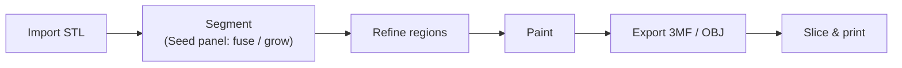

# Getting Started

> Part of the CYM wiki. Start here if you want to build and run ColorYourModel.

## What you need

- [Node.js](https://nodejs.org/) ≥ 18 (frontend toolchain)
- [Rust](https://www.rust-lang.org/tools/install) ≥ 1.70 + Cargo (backend)
- [Tauri 2 system prerequisites](https://v2.tauri.app/start/prerequisites/) — on Windows this is mainly WebView2

## Build & run

```bash
git clone https://github.com/ZackaryShen/ColorYourModel.git
cd ColorYourModel

npm install
npm run tauri dev      # first run compiles the Rust backend (~2-3 min)
```

The dev build gives you hot reload for the frontend; incremental Rust builds are fast after the first compile.

For a packaged release build, use `npm run tauri build` (produces the installer for your platform).

## Your first colour job

1. **Import** an STL white model (binary or ASCII). 1.5M-face-class models load in ~4 s with a progress bar.
2. **Segment** — nothing runs automatically; open the **Seed panel** and click fuse (or place seeds and grow) — see [Seed Tools](seed-tools.md). The model stays fully usable unsegmented: normal Fill clicks are radius-bounded.
3. **Refine regions** — merge/split/rename regions in the Segments panel, or resegment a single one.
4. **Paint** — pick a tool and go (see [Painting Tools](painting-tools.md)). Everything is undoable.
5. **Export** a 3MF with machine presets, or an OBJ with per-face colours (see [Exporting](exporting.md)), and slice it in Snapmaker Orca / OrcaSlicer.



## Verification & tests

```bash
npx tsc --noEmit               # TypeScript
npx vitest run                 # frontend unit tests
cd src-tauri && cargo test --lib   # backend unit + regression tests
```

## Debug logging

```bash
# Windows PowerShell
$env:RUST_LOG="debug"; npm run tauri dev

# Linux / macOS
RUST_LOG=debug npm run tauri dev
```

Frontend exceptions are captured by the JS bridge and viewable in the in-app **DebugLogViewer** (see [Crash Diagnostics](../technical/crash-diagnostics.md)).

## Troubleshooting

| Symptom | What to check |
|---------|---------------|
| First run takes minutes | Normal — Rust compiles from scratch; later runs are incremental |
| Model fails to load | Check the log; UV-sphere-style meshes with many coincident-axis vertices are supported since the kdtree fix (`69a17ea`) |
| UI language is English by default? | No — the app starts in Chinese; switch in the UI, the choice is persisted (see [development guide, conventions](../developer/development.md#conventions)) |
