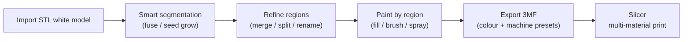
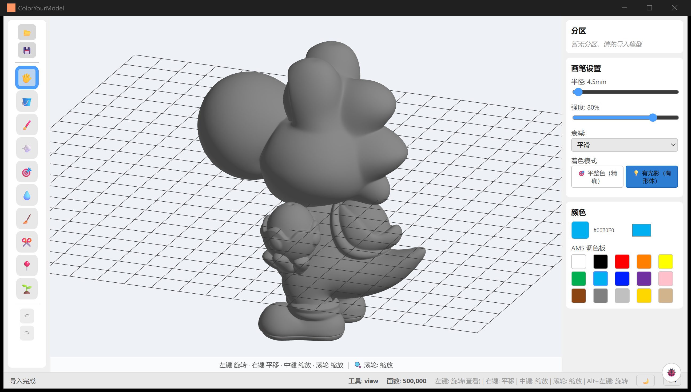
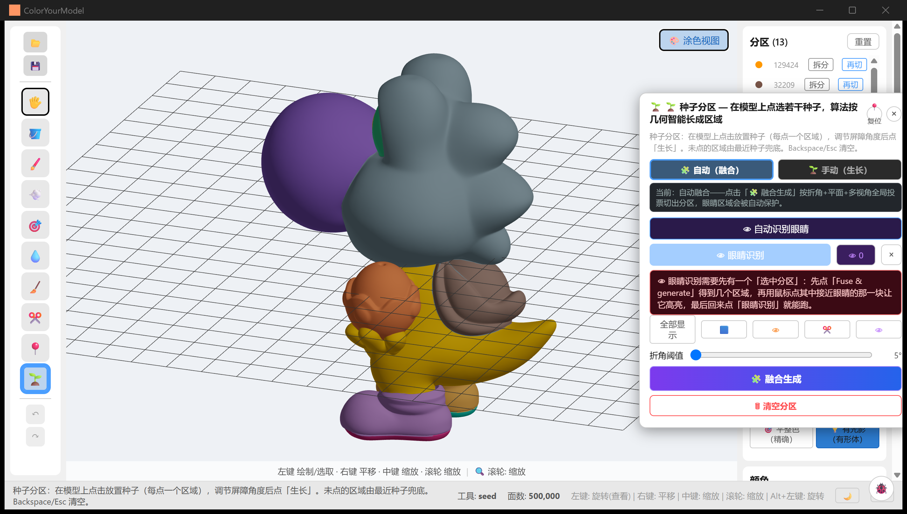
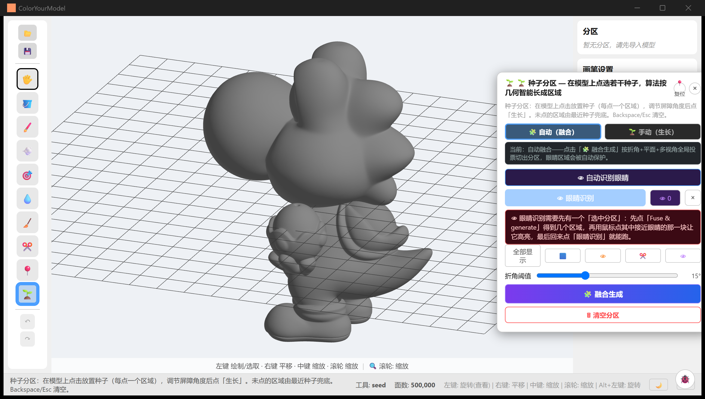
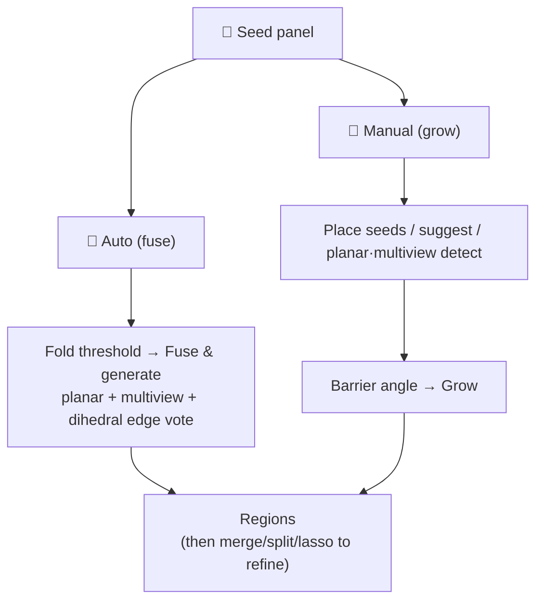
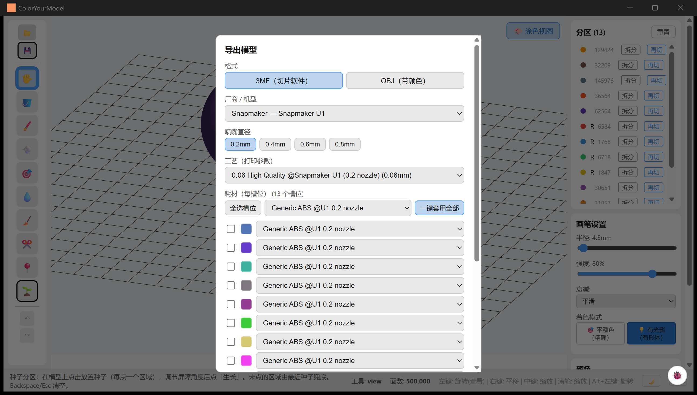

# CYM User Manual (v0.1.1)

> **English** | [简体中文](manual.md)
>
> The complete operator's manual: what every button does, every keyboard shortcut, every kind of interaction — plus which capabilities are experimental or have known limitations right now. Written for first-time users; when this page and the code disagree, the source code wins. This page matches **v0.1.1**; the UI language follows the system locale (Chinese on zh systems, English elsewhere) and can be switched any time.
>
> For real-run demos see the [Examples Gallery](../cases/examples.md); for build & development setup see [Getting Started](getting-started.md).

## What is this software for?

The 3D-printing community is full of "white models" — single-colour STL files that are just a pile of unstructured triangles, with no "regions" and no colour. Colouring such a model in a slicer means clicking thousands of tiny triangles one by one — hopeless for anything detailed.

**ColorYourModel (CYM) turns that into a few clicks**: it first segments the mesh into meaningful regions (helmet, skin, base…), you paint region by region, and the final export is a standards-compliant 3MF carrying per-region colours — the slicer (Snapmaker Orca / OrcaSlicer) opens it as a fully configured multi-material job, no manual filament mapping.

| Good fit | Poor fit |
|----------|----------|
| Figures / sculptures (characters, creatures, heads with eyes) | Precise CAD part modelling (this is not a CAD tool) |
| Signs / facades / hard-surface architecture | Work that needs UV texture painting (CYM paints flat region colours) |
| AI-generated meshes (Tripo etc.) exported as STL | Heavily holed meshes (picking falls through — see section 6) |
| Dioramas / miniatures | |

> Download: [GitHub Releases](https://github.com/ZackaryShen/ColorYourModel/releases). v0.1.1 ships Windows installers, Linux packages and a macOS universal dmg (unsigned).

## Interface overview

The window has five parts: the **left toolbar** (import/export, 10 tools, undo/redo), the **viewport** (the 3D model), the **right panels** (Regions, Brush Settings, Color), the **bottom status bar** (hints / tool / face count / language / theme), plus a **shortcut hint bar** along the bottom edge of the viewport.

*The interface after import: left toolbar, viewport (a 500K-face cartoon white model), the three right-hand panels (Regions / Brush Settings / Color), and the status bar.*

## 0. Top menu bar (new in v0.1.1)

A classic three-menu bar now sits at the top of the window:

- **File**: Import STL, Export painted model, Quit — with unexported paint or segmentation changes, quitting (including the window close button) pops an in-app confirmation: **Stay / Quit anyway**; with no changes it exits silently.
- **View**: Reset view, UI language, light/dark theme, debug-log toggle.
- **Help**: User guide (follows the UI language), Examples gallery, Documentation home, GitHub Discussions, **Check for updates…**, About (version + "check for updates on startup" toggle).

## 1. Importing a model

1. Click the **📂** button (top-left) and pick an **STL file** (binary or ASCII).
2. A large model (1.5M faces) loads in ~3–4 seconds behind a progress bar; the status bar shows the total face count when done.

Import is the whole load — **the model comes in with no regions** (one big region). That is deliberate: the model is browsable immediately, and segmentation is something you start explicitly in section 4. You can already paint right away — Fill's normal click works radius-bounded without regions.

**About formats**:

- Only **STL** is supported; the file picker shows `.stl` only.
- To colour a split 3MF: convert the 3MF to STL first. Note that slicer-split part STLs use "print layout" coordinates (parts laid flat on the plate), not assembly positions — importing several parts scatters them, and fragmented plates confuse auto-segmentation, so process them one at a time.
- Sphere-like STLs ("same-latitude rings sharing axis coordinates") used to crash the import; fixed well before v0.1.0.

## 2. Brushes and shortcuts

The 10 tools in the left toolbar are **mutually exclusive** (the active one gets a blue outline). Hover any button for a Chinese tooltip; brush, spray and smart brush also show their live radius and strength there.

| Icon | Tool | Behaviour | Notes |
|------|------|-----------|-------|
| 🖐️ | View / Navigate | Camera only, never paints | Left rotate, right pan, middle/wheel zoom |
| 🪣 | Fill | Paints from the clicked face; the rule depends on segmentation | **With regions: normal click paints the whole region in one shot**; **without regions: normal click paints a radius-bounded blob**; **Shift+click floods along the surface** (stops at region boundaries when segmented; floods the whole model when not — careful) |
| 🖌️ | Brush | Smooth continuous painting with edge falloff | Best for freehand; one drag = one undo entry |
| 💨 | Spray | Random scattered dots inside the radius | Spray-can texture; scatter density is fixed (no slider yet); shares radius/strength with the brush |
| 🎯 | Smart brush | Brush constrained to one region + normal filtering | Never crosses region boundaries and never bleeds through thin walls; unsegmented, the normal filter still protects back faces |
| 💧 | Eyedropper | Picks the colour under the cursor | Acts only on the initial click — dragging does not re-pick |
| 🧹 | Eraser | Strips colour back to the default base | Affected by radius only — the strength slider does nothing here (erase is a hard reset, no falloff) |
| ✂️ | Segment brush | Drag across faces, release to create a new region | The primary manual segmentation tool; good for patching fuse results |
| 📍 | Lasso | Click vertices to enclose an area, close at the start point (cyan snap hint) | The boundary follows the surface shortest path, hugging the geometry; see section 4 |
| 🌱 | Seed | Drop seed points, driven from the Seed panel | See section 4 |

**Brush Settings** (right panel): **Radius** 0.5–200 mm, **Strength** 10%–100%, **Falloff** (Smooth / Linear / Step — note "Step" actually paints about half the shown radius), **Shading** (Flat = exact WYSIWYG colour; Shaded = keeps form lighting so you can read the shape).

**Color panel** (right): current-colour swatch + HEX + the system colour picker (any colour), plus the **AMS palette** of 15 common colours. Palette slots map to filament slots at export time (section 5).

### Undo / redo

Painting, erasing, manual regions and lasso all share one undo timeline (managed by the backend): **Ctrl+Z** undo, **Ctrl+Y** or **Ctrl+Shift+Z** redo, or the ↶ / ↷ toolbar buttons. One whole drag stroke is one entry — never dozens. Note that **🗑 Reset partition and Reset are NOT undoable**.

### Shortcut table (every shortcut in this release)

| Keys | Context | Action |
|------|---------|--------|
| `Alt` (hold) | Any tool active | Temporarily rotate the camera (release returns to the tool) |
| `Ctrl+Wheel` | Brush/spray/smart/eraser hovering the model | Resize the brush (0.5–200 mm), live in the status bar |
| `Ctrl+Z` | Global (except while typing) | Undo; with the lasso, pops the last point while a loop is open |
| `Ctrl+Y` / `Ctrl+Shift+Z` | Global | Redo (no per-point redo for open lasso loops) |
| `Backspace` | Lasso tool | Remove the last placed point |
| `Esc` | Lasso tool | Cancel the open loop |
| `Enter` | Lasso tool | Close the region (at least 3 points) |
| `Esc` / `Backspace` | Seed tool | Clear all placed seeds and exit eraser mode |
| `Esc` | Seed panel open | Closes the panel **and clears all placed seeds**, returning to the View tool (the panel's × does the same; closing never keeps seeds) |
| `Ctrl+Shift+L` | Global | Toggle the debug log panel (🐞) |

> Tools themselves have **no** number-key shortcuts — switch tools via the toolbar. Undo shortcuts are inert while you type in a text field.

## 3. Camera and interaction

CYM uses an **orthographic camera**: zooming changes the view scale, not perspective — the model never distorts, which makes checking paint coverage easy.

| Input | Effect |
|-------|--------|
| Scroll wheel | Zoom, range **0.1×–500×** (500× resolves sub-millimetre detail) |
| Middle-drag | Zoom (equivalent to the wheel, continuously smooth) |
| Left-drag | Rotate (View tool; or any tool pressed on **empty space**) |
| Right-drag | Pan |
| `Alt`+Left | Force-rotate under any tool |

Tips:

- **Rotate while painting**: no need to switch back to View — move the mouse off the model and drag, or hold `Alt` and drag. Release and keep painting.
- **Fine detail**: `Ctrl+Wheel` down to a 1–2 mm brush, zoom to 50×–100×, paint dots in Flat shading.
- **No inertia**: drags stop dead on release (damping is intentionally off) — what you drag is what you get.
- With the fill/eyedropper/segment tools, the region under the cursor **highlights** on hover — see what you are about to paint before clicking.
- Brush-class tools show a **3D ring** that follows the mouse with the live radius and colour.
- Once regions exist, a **🎨 Paint view / 🗺️ Segment view** toggle appears in the **top-right** of the viewport: segment view colourises regions by label and outlines boundaries (yellow in the dark theme, amber-brown in light) for quality checks; neighbouring regions are essentially never the same colour (30 palette slots with adjacency-aware allocation).

*Segment view: the 500K-face cartoon model fused at fold threshold 5° into 13 regions — adjacent regions in different colours, boundaries outlined.*

### Viewport gizmo (new in v0.1.1)

An Orca-style navigation gizmo lives in the **bottom-right** of the viewport:

- **Direction cube**: the six faces carry direction words (Top / Bottom / Front / Back / Left / Right). **Click a face** and the camera animates to that orthographic view; the status bar reports it.
- **Axis triad**: three coloured rods welded to one cube corner map 1:1 to the model X/Y/Z axes.
- **Drag to orbit**: press inside the dial and drag to orbit the camera (same as left-drag rotate).

The gizmo area is isolated from paint / lasso / wheel input — a slip on it never paints the model.

## 4. Smart segmentation

Segmentation starts from the **🌱 seed tool**: click 🌱 in the toolbar and a draggable **Seed panel** pops over the model (drag the title bar to move, double-click it or press 📍 to reset, close with × or `Esc` — note closing also clears any placed seeds).

*The Seed panel's Auto (fuse) tab: mode tabs, eye-detection entries, per-layer solo buttons, the fold-threshold slider and "Fuse & generate".*

### Auto (fuse) — the recommended first stop

One click produces the partition: **Fold threshold** (0–35°, default 5° since v0.1.1) + **🧩 Fuse & generate**. It votes every edge across three channels — planar regions, multi-view evidence, and the dihedral backbone — and only cuts when the cut votes win, which suppresses over-splitting and keeps regions chunky. A staged progress bar runs while it works (detecting planar regions → rendering multi-view evidence → fusing by edge vote).

**Choosing the fold threshold** (the one parameter that matters):

| Model class | Suggested value | Why |
|-------------|-----------------|-----|
| Sculpted figures (characters / creatures) | **0–3°** | Sculpt folds at neck/shoulders/hips spread over many sub-5° edges; only a low threshold separates head / limbs / tail |
| Hard surface (signs / kiosks / architecture) | **5–15°** | Creases are already hard boundaries; a higher threshold keeps flat walls whole |

Lower = finer, higher = coarser. Too fragmented? Raise it and fuse again. Not splitting? Lower it. A 1.5M-face model takes about a minute at 0° — that is normal. Detected **eye regions are protected** and survive the fuse.

> **Changed in v0.1.1**: the fold-threshold default rose from 2° to 5° (sculpted figures still want a manual 2–3°). After a fuse, if you are in paint view a non-blocking card appears at the top of the viewport — **Switch to segment view / Stay in this view** — the choice stays yours.

### Manual (grow) — fine control

1. **Click the model to place seeds** (each green dot = one future region); `Backspace`/`Esc` clears all, and **🩹 Eraser mode** deletes a single seed on click.
2. Or let the panel suggest them: **💡 Suggest seeds** (saliency-based; tunable count 2–40, curvature weight, concavity weight), **🟦 Planar seeds** (flat-patch detection), **👁 MultiView** (multi-angle consensus). Suggestions appear as magenta ghosts — click near one to accept it.
3. Set the **Barrier angle** (10–90°, default 45°: adjacent faces whose normals differ more stop the growth), optionally tick **Optimize (merge tiny regions)**, then **🌱 Grow**.
4. Patches no seed claims fall to the nearest seed.

**Eye detection** (two entries at the bottom of the panel):

- **👁 Auto eye detect**: scans the whole mesh for symmetric eye bumps and regions them — no prerequisites.
- **👁 Eye detect**: decomposes the **currently selected region** into globe / sclera / eyelid / socket sub-regions. Requires a selected region first — fuse once, then use **🖱 Pick a partition** to click the eye-area region on the model.

### Regions panel (right) — refining

Fuse/grow results are a starting point; the **Regions** panel cleans up:

- **Select**: click a list entry, or click a region on the model (highlight in the viewport).
- **Merge**: `Ctrl+click` multi-select (first pick is the survivor), then merge.
- **Rename**: double-click an entry.
- **Split**: re-cut an oversized region along its internal creases (default threshold 30°).
- **Re-cut**: re-run a whole algorithm inside one region (the fix for tubular limbs convex decomposition can't cut); 8 algorithms, see section 6.
- **Reset**: wipe all regions and paint (**not undoable**; asks for confirmation).

The lasso (📍) is the last mile of refinement — where geometry offers no boundary (a smooth cheek, a flat wall band), draw the region by hand. Click vertices in turn, close at the start point or press `Enter` (≥3 points); closing runs a progress bar (snap → surface boundary completion → enclosure → smoothing → commit) because on million-face meshes every stage is real work.

## 5. Exporting 3MF

Click **💾** in the toolbar (a model must be loaded) to open the export dialog:

1. **Format**: 3MF (for slicers, default) / OBJ (with colour).
2. **Vendor / Machine**: currently the embedded **Snapmaker U1** preset (nothing to install).
3. **Nozzle diameter**: 0.2 / 0.4 / 0.6 / 0.8 — the process list filters automatically.
4. **Process**: the print profiles available for that machine + nozzle (0.20 Standard etc.).
5. **Filament (per slot)**: one filament per palette slot; tick several slots and **Apply to selected**, or **Apply to all**. A slot colour preview renders before export.
6. **Target slicer**: Snapmaker Orca (default) or OrcaSlicer (generic) — decides the machine id written into the file.
7. **Choose location & export**. Machine/nozzle/process/filaments/slicer are remembered for next time (the format switch is not — it resets to 3MF).

*The export dialog: 13 regions map to 13 filament slots, each selectable individually or in bulk.*

The exported 3MF is verified end-to-end: imported into Snapmaker Orca (U1), machine, process and multi-filament colours all land correctly (see the [verification case](../cases/01-3mf-end-to-end.md)).

**OBJ**: writes `.obj` + `.mtl` with per-face colours (quantized to at most 256) and needs no machine/process picks. For Blender / MeshLab / web viewers; for printing, use 3MF.

## Auto-update (new in v0.1.1)

- **Startup check** (Windows): 4 seconds after launch the app silently checks GitHub Releases once per session; offline, rate-limited or timed-out checks never surface. A newer release pops a dialog: **Update now / Later / Skip this version / Never remind**.
- **Manual check**: Help → Check for updates… — every outcome gets explicit feedback (up to date / error with retry).
- **The update itself** (Windows): streamed to a temp folder with progress (cancellable, 30 s stall detection), then the official installer runs passively (progress bar + automatic relaunch, current-user rights, no UAC).
- **Toggle**: About → "check for updates on startup" reverses "Never remind" at any time.
- **macOS / Linux**: the dialog links to the GitHub releases page for a manual download.

## 6. Experimental features and current limitations

These work today, but know their edges — not bugs, just the honest water level of v0.1.1.

### Experimental

| Feature | Status | Advice |
|---------|--------|--------|
| The 5 advanced re-cut algorithms: SDF graph-cut / concavity fields / convex decomposition (V-HACD) / curve skeleton / FH graph | The first two are marked experimental in code; all five are recent additions that collapsed hundreds of fragments into 4–7 semantic parts in benchmarks, but are parameter-sensitive | Stick to curvature k-means / dihedral / shape diameter by default; A/B the rest when those fall short |
| ✂️ Cross-section detection (Seed panel) | Purely visual evidence: draws feature cross-sections, **creates no regions and never votes** | Treat it as an analysis overlay, not a segmenter |
| 👁 Eye detection | Sclera is heuristic and low-confidence; globe/eyelid/socket are more reliable | Use as an underlay, refine by hand |
| 👁 MultiView detection | A second-opinion channel (12-view projection consensus) | Pair with planar seeds; weak alone |
| 🐞 Debug log (`Ctrl+Shift+L`) | Diagnostics: shows the frontend log ring | Attach a screenshot when filing bugs |

### Known limitations (v0.1.1)

- **Repeated passes within one stroke darken the colour**: the same face gets mixed multiple times inside a stroke. Slow down, or use fill/smart brush to avoid it.
- **"Step" falloff paints about half the shown radius**, with no separate UI indication.
- **Region boundaries are jagged**: boundary smoothing only mitigates; ruler-straight edges need a different approach.
- **Holes in the mesh** let click-picking fall through (the ray escapes through the hole).
- **Very large models (4M+ faces)**: fusing takes long and can stall the UI — split or decimate first; the first switch to segment view also computes once with a visible hitch.
- **OBJ export quantizes to at most 256 colours**; beyond that, colours merge.
- **The machine preset library currently holds only the Snapmaker U1**: other machines should export with OrcaSlicer (generic) and assign filaments in the slicer.
- **Segment-view colours ≠ your paint**: segment view shows diagnostic colours by region label; the shipped colours are what you painted (labels are the truth, colour is the output).

### Feedback

Crashes, clearly wrong segmentations, unimportable exports: please file at [GitHub Issues](https://github.com/ZackaryShen/ColorYourModel/issues) with the face count (status bar), OS, and a `Ctrl+Shift+L` log screenshot.

## Appendix: status bar, language, theme

- **Status bar**: live hints on the left (lasso and seed tools print full usage on activation; otherwise the last message stays), the active tool and face count in the middle, and on the right the input cheatsheet plus three switches: the **🐞 debug log**, **🌙/☀️ dark/light theme**, and the **中/EN UI language** (theme and language persist across restarts).
- The Regions panel shows "no regions yet" whenever there is nothing to list (before import, or after import before segmenting); the paint/segment view toggle appears only once regions exist.
