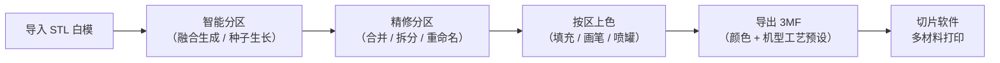
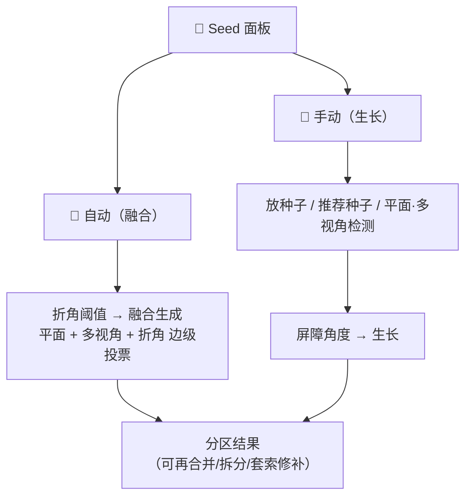

# CYM 使用手册（v0.1.0）

> **简体中文** | [English](manual.en.md)
>
> 面向使用者的完整操作说明：每个按钮是干什么的、每个快捷键是什么、每一类交互怎么用，以及哪些能力目前收益有限、用前要有预期。以零基础视角编写；与代码行为冲突时以源码为准。本文对应 **v0.1.0（Windows x64）**，界面默认中文。
>
> 操作演示与更多成品见 [Examples Gallery](../cases/examples.md)；构建与开发环境见 [Getting Started](getting-started.md)。

## 这款软件是干什么的？

3D 打印社区流传着大量"白模"STL——一整块单色三角面片，没有"区域"、没有颜色。想在切片软件里给手办上色，只能对着成千上万个小三角一个个点，细节稍多就不可能完成。

**ColorYourModel（CYM）把这件事变成"点几下"**：它先把网格自动切成有意义的分区（头盔、皮肤、底座……），你按分区上色，最后导出带分区颜色的标准 3MF——切片软件（Snapmaker Orca / OrcaSlicer）打开就是配置好的多耗材打印任务，不用再手动指颜色。

| 适合 | 不太适合 |
|------|----------|
| 手办 / 雕塑（人物、生物、带眼睛的头部） | 精确 CAD 零件建模（这不是建模软件） |
| 招牌 / 门头 / 建筑硬表面 | 需要 UV 贴图绘制的场景（CYM 是分区纯色） |
| AI 生成模型（Tripo 等）导出的 STL | 含破洞严重的网格（拾取会穿透，见第 6 节） |
| 情景模型 / 微缩场景 | |

> 下载安装包：[GitHub Releases](https://github.com/ZackaryShen/ColorYourModel/releases)。当前 v0.1.0 提供 Windows 安装包与 Linux 包（暂无 macOS）。

## 界面总览

窗口分五块：**左侧工具栏**（导入/导出、10 个工具、撤销重做）、**中间视口**（3D 模型）、**右侧面板**（分区列表、画笔设置、颜色）、**底部状态栏**（提示 / 工具 / 面数 / 语言 / 主题）、视口底边还有一条**快捷操作提示**。

*导入白模后的界面：左侧工具栏、中间视口（50 万面卡通白模）、右侧「分区 / 画笔设置 / 颜色」三个面板、底部状态栏。*

## 1. 导入模型

1. 点左上角 **📂** 按钮，选择一个 **STL 文件**（二进制或 ASCII 均可）。
2. 大模型（如 150 万面）加载约 3–4 秒，期间显示进度条；完成后状态栏显示总面数。

导入即完成——**导入后模型没有任何分区**（通体一个区），这是有意设计：模型立刻可浏览、可查看，分区由你在第 4 节显式发起。此时就可以直接用画笔/填充涂色（填充按半径生效，不依赖分区）。

**关于文件格式**：

- 目前**只支持 STL**。文件选择器只显示 `.stl`。
- 想给 3MF 拆件模型上色：先用转换工具把 3MF 转成 STL 再导入。注意切片软件拆出的分件 STL 是"打印排布"坐标（零件平铺在板上），不是装配位置——多个零件导入会散开，且碎件会干扰自动分区，建议逐件处理。
- 球面类"同一纬度环共享轴坐标"的 STL 曾经会闪退，v0.1.0 已修复，可放心导入。

## 2. 各类画笔与快捷键

左侧工具栏的 10 个工具**同时只能激活一个**（选中的有蓝色描边）。鼠标悬停按钮有中文提示；画笔、喷罐、智能笔三个工具的提示里还会实时显示当前半径和强度。

| 图标 | 工具 | 行为 | 要点 |
|------|------|------|------|
| 🖐️ | 查看/导航 | 纯相机操作，不涂色 | 左键旋转、右键平移、中键/滚轮缩放 |
| 🪣 | 填充 | 点击处上色，规则随分区状态变化 | **有分区时：普通点击 = 整个分区一键上色**；**未分区时：普通点击 = 半径限定的一团上色**；**Shift+点击 = 沿表面连通洪水**（有分区时止步于分区边界；未分区时会淹没全模型，慎用） |
| 🖌️ | 画笔 | 按住拖动平滑涂色，边缘渐变 | 适合自由绘制；一笔拖动只算一条撤销记录 |
| 💨 | 喷罐 | 半径内随机散点喷涂 | 模拟喷漆颗粒感；散点密度固定（暂无滑杆），半径/强度共用画笔设置 |
| 🎯 | 智能笔 | 画笔 + 只涂同一分区 + 法向过滤 | 不会涂出分区边界，也不会透过薄壁涂到背面；未分区时法向过滤仍然生效（依旧防背面穿透），只是没有分区边界约束 |
| 💧 | 吸管 | 从模型表面拾取颜色 | 点击即吸取到当前颜色；只在按下瞬间生效，拖动不重复吸取 |
| 🧹 | 橡皮 | 擦除颜色，恢复默认底色 | 只受半径影响——强度滑杆对橡皮无效（擦除是硬复位，不做渐变） |
| ✂️ | 分区画笔 | 拖拽涂选一片面，松开鼠标即建成新分区 | 手动分区的第一手段；可在融合结果上补切 |
| 📍 | 选点套索 | 依次点击顶点围出一个区域，回起点闭合（青色吸附点提示） | 边界沿表面走最短路径，贴合几何；详见第 4 节 |
| 🌱 | 种子分区 | 点放种子点，配合右侧弹出的 Seed 面板生长分区 | 详见第 4 节 |

**画笔设置**（右侧面板）：**半径** 0.5–200mm、**强度** 10%–100%、**衰减**（平滑 / 线性 / 阶梯——注意"阶梯"的实际着色半径约为显示值的一半）、**着色模式**（平整色=所见即所得的精确颜色；有光影=保留形体明暗，方便观察结构）。

**颜色面板**（右侧）：当前颜色预览 + HEX 值 + 系统取色器（可选任意颜色），下方 **AMS 调色板** 15 个常用色。这里的颜色槽位在导出 3MF 时对应耗材槽位（见第 5 节）。

### 撤销 / 重做

涂色、擦除、手动分区、套索全部走同一条撤销时间线（后端统一管理）：**Ctrl+Z** 撤销、**Ctrl+Y** 或 **Ctrl+Shift+Z** 重做，也可以点工具栏 ↶ / ↷。一次拖动产生的整条笔画是一条记录，不会被拆成几十条。注意：**「🗑 清空分区」和「重置」不可撤销**。

### 快捷键总表（当前版本全部快捷键）

| 按键 | 生效场景 | 作用 |
|------|----------|------|
| `Alt`（按住） | 任何工具激活时 | 临时旋转视角（松开回到原工具行为） |
| `Ctrl+滚轮` | 画笔/喷罐/智能笔/橡皮悬停在模型上 | 调节笔刷半径（0.5–200mm），状态栏实时显示 |
| `Ctrl+Z` | 全局（输入框内除外） | 撤销；套索工具下若有未闭合选点则先逐点回退 |
| `Ctrl+Y` / `Ctrl+Shift+Z` | 全局 | 重做（套索未闭合的选点没有重做） |
| `Backspace` | 套索工具 | 删除最后一个选点 |
| `Esc` | 套索工具 | 取消当前未闭合的套索 |
| `Enter` | 套索工具 | 闭合选区（至少 3 个点） |
| `Esc` / `Backspace` | 种子工具 | 清空全部已放种子，并退出擦除模式 |
| `Esc` | Seed 面板打开时 | 关闭面板**并清空全部已放种子**，同时切回查看工具（面板上的 × 关闭也一样清空；种子无法只靠关面板保留） |
| `Ctrl+Shift+L` | 全局 | 开关调试日志面板（🐞） |

> 工具本身目前**没有**数字键快捷键，切换工具请点左侧工具栏。输入框内打字时撤销快捷键不会误触。

## 3. 视角与交互（相机、缩放小技巧）

CYM 使用**正交相机**：缩放改变的是视图倍率而非透视距离，模型不会发生近大远小的畸变——这对检查涂色均匀度很友好。

| 操作 | 效果 |
|------|------|
| 滚轮 | 缩放，范围 **0.1×–500×**（500 倍可看清亚毫米细节） |
| 中键拖拽 | 缩放（等价滚轮，可平滑连续变焦） |
| 左键拖拽 | 旋转（🖐️ 查看工具下；或任何工具在**空白处**按下时） |
| 右键拖拽 | 平移 |
| `Alt`+左键 | 任何工具下强制旋转 |

小技巧：

- **涂色时转视角**：画到一半想换角度，不需要切回查看工具——把鼠标移出模型到空白处拖左键，或按住 `Alt` 拖左键即可旋转，松手继续画。
- **画细部**：`Ctrl+滚轮` 把笔刷缩到 1–2mm，滚轮放大到 50×–100×，配合"平整色"模式点涂。
- **没有惯性**：松手即停（刻意关闭了阻尼），拖多少转多少，不会"滑头"。
- 鼠标悬停在填充/吸管/分区画笔工具下时，光标下的整个分区会**高亮**——先看清楚会涂到哪，再下手。
- 画笔工具下有一个跟随鼠标的 **3D 圆环**，实时显示笔刷半径和当前颜色。
- 有分区之后，视口**右上角**出现 **🎨 涂色视图 / 🗺️ 分区视图** 切换：分区视图按区域编号着色并描出边界线（深色主题为黄色、浅色主题为橙棕色），用于检查分区质量；相邻分区基本不会同色（30 色槽位 + 相邻避让分配），不会看混。

*分区视图：50 万面卡通模型在折角阈值 5° 下融合出的 13 个分区，相邻区颜色不同，边界线清晰。*

## 4. 智能分区

分区的入口是 **🌱 种子分区工具**：点工具栏 🌱，模型上会弹出一个可拖动的 **Seed 面板**（拖标题栏移动，双击标题栏或点 📍 复位，× 或 `Esc` 关闭——注意关闭会把已放的种子一并清空）。

*Seed 面板的「自动（融合）」标签页：模式切换、眼睛识别入口、图层独显按钮、折角阈值滑杆与「🧿 融合生成」。*面板分两个标签页：

### 自动（融合）——推荐首选

一键出结果：**折角阈值**（0–35°，默认 2°）+ **🧩 融合生成**。它按"平面区域 + 多视角证据 + 折角骨干"三通道对每条边投票，多数票通过才切开——抗过切，结果成块。运行时有分阶段进度条（检测平面区域 → 多视角证据渲染 → 边级投票融合分区）。

**折角阈值怎么选**（这是唯一需要理解的参数）：

| 模型类型 | 建议值 | 原因 |
|----------|--------|------|
| 雕塑手办（人物/生物，哥斯拉类） | **0–3°** | 雕塑的肩、颈、胯折角被摊平在大量 <5° 的小面上，只有低阈值能切出头/四肢/尾巴 |
| 硬表面（招牌/门头/建筑件） | **5–15°** | 棱角本身是硬边界，高阈值保持大平面完整 |

越低切得越细、越高越粗；切太碎就调高再融合，切不开就调低。150 万面模型 0° 融合约需 1 分钟，属正常耗时。已检出的**眼睛区域会被自动保护**，不会被融合切开。

### 手动（生长）——精细控制

1. 在模型上**点击放种子**（每点一个绿色圆点 = 一个未来区域的起点）；`Backspace`/`Esc` 清空全部，**🩹 擦除模式**下点击某个种子可单个删除。
2. 不想手动放？用面板里的自动建议：**💡 推荐种子**（按显著性挑点，可调"推荐数量 2–40、曲率权重、凹度权重"）、**🟦 平面种子**（检测大平面）、**👁 多视角**（多角度共识块）。建议以品红色幽灵点出现，点它附近即采纳。
3. 调**屏障角度**（10–90°，默认 45°：相邻面法线差超过它就断开，区域不越界），可选勾**智能优化（合并微小区域）**，点 **🌱 生长**。
4. 未被任何种子覆盖的角落会归给最近的种子。

**眼睛识别**（两个入口，都在面板下方）：

- **👁 自动识别眼睛**：全网格扫描对称的眼部凸起并自动成区，无需任何前置条件。
- **👁 眼睛识别**：对**当前选中分区**做精细分解，切出眼球/眼白/眼睑/眼眶四个子区域。需要先选中一个包围眼睛的分区——先融合一次，再用「🖱 点选分区」在模型上点那块区域（或点选后回面板）。

### 分区面板（右侧）——精修

融合/生长的结果只是起点，右侧**分区**面板负责收拾：

- **选中**：单击列表项或直接在模型上点分区（视图高亮）。
- **合并**：`Ctrl+点击` 多选（先选的作为合并目标），点合并。
- **重命名**：双击列表项。
- **拆分**：对过大的分区按内部棱角再切（棱角阈值默认 30°）。
- **再切**：对单个分区换算法重切（管状肢体凸分解切不开时的解法），8 个算法可选，见第 6 节。
- **重置**：清空全部分区与上色（**不可撤销**，弹确认框）。

套索（📍）是分区精修的最后一环：几何上没有边界可借的地方（光滑脸颊、平坦墙面），用套索手画一个区。依次点击顶点，回起点闭合或按 `Enter`（≥3 点）；闭合后有进度条（吸附 → 沿表面补全边界 → 圈选 → 平滑 → 写入），百万面模型上每一步都是真实计算，请稍候。

## 5. 导出 3MF

点工具栏 **💾**（需已加载模型）打开导出对话框：

1. **格式**：3MF（切片软件，默认）/ OBJ（带颜色）。
2. **厂商 / 机型**：当前内置 **Snapmaker U1** 的完整预设（无需安装任何机型配置）。
3. **喷嘴直径**：0.2 / 0.4 / 0.6 / 0.8，选完工艺列表自动过滤。
4. **工艺**：该机型+喷嘴下可用的打印配置（0.20 Standard 等）。
5. **耗材（每槽位）**：每个调色板槽位指定一种耗材；可勾选多个槽位后**套用到所选**，或**一键套用全部**。导出前有槽位颜色预览。
6. **目标切片器**：Snapmaker Orca（默认）或 OrcaSlicer（通用），决定写入文件的机型标识。
7. **选择保存位置并导出**。机型/喷嘴/工艺/耗材/切片器的选择会被记住，下次打开自动恢复（格式开关除外，每次打开默认回到 3MF）。

*导出对话框：13 个分区对应 13 个耗材槽位，每个槽位可单独选耗材，也可勾选后批量套用。*

导出的 3MF 已做端到端验证：导入 Snapmaker Orca (U1) 后机型、工艺、多耗材颜色一次到位（见[验证案例](../cases/01-3mf-end-to-end.md)）。

**OBJ**：输出 `.obj` + `.mtl`，逐面写入颜色（量化到最多 256 色），不需要机型/工艺选择。给 Blender / MeshLab / 在线查看器用；要打印还是选 3MF。

## 6. 实验性功能与当前局限

以下能力**能用，但用前要知道边界**——不是缺陷，是当前阶段的真实水位。

### 实验性功能

| 功能 | 现状 | 建议 |
|------|------|------|
| 「再切」的 5 个进阶算法：SDF 图割 / 凹度场 / 凸分解 V-HACD / 曲线骨架 / FH 图分割 | 前两个在代码里明确标注 experimental；五个都是后加的算法，在测试基准上能把数百碎片收敛成 4–7 个语义块，但参数敏感 | 默认用曲率 K-Means / 二面角 / 形态直径即可；不够时逐个 A/B 试 |
| ✂️ 截面检测（Seed 面板） | 纯视觉证据：画出特征截面轮廓，**不生成分区、不参与投票** | 当作分析工具看，别等它出分区 |
| 👁 眼睛识别 | 眼白（Sclera）是启发式判定，置信度低；眼球/眼睑/眼眶较可靠 | 结果只当参考底稿，手动再修 |
| 👁 多视角检测 | 第二意见通道，12 视角投影共识 | 与平面种子配合用，单独用信号较弱 |
| 🐞 调试日志（`Ctrl+Shift+L`） | 面向排障：显示前端运行日志 | 报 bug 时可附截图 |

### 已知局限（v0.1.0）

- **一笔内重复经过同一处，颜色会加深**：同一笔画内同一面被多次着色时叠加。放慢笔画或用填充/智能笔规避。
- **"阶梯"衰减的笔刷实际半径约为显示值的一半**，UI 不单独提示。
- **分区边界有锯齿**：边界平滑只能缓解，做不到笔直线条。
- **网格有破洞时**，点击拾取可能穿透落空（射线从洞里穿过去）。
- **超大模型（400 万面+）**：融合分区耗时长且可能卡界面，建议拆件或降面后再分区；首次切到分区视图会有一次同步计算的小卡顿。
- **OBJ 导出最多 256 色**：超出的颜色会被量化合并。
- **机型预设目前只有 Snapmaker U1**：其他机型选 OrcaSlicer（通用）导出后，在切片软件里自行指派耗材。
- **分区视图的分区颜色 ≠ 你涂的颜色**：分区视图是按区域编号的"诊断色"，最终颜色以涂色视图为准（标签是权威，颜色是输出）。

### 反馈

遇到崩溃、分区明显不合理、导出打不开：请到 [GitHub Issues](https://github.com/ZackaryShen/ColorYourModel/issues) 提交，附上面数（状态栏有）、操作系统、`Ctrl+Shift+L` 日志截图。

## 附：状态栏、语言与主题

- **状态栏**：左侧是实时提示（套索、种子工具激活时会显示完整用法，其余时刻保留最近一条消息），中间是当前工具名和模型面数，右侧是操作提示与三个开关：**🐞 调试日志**、**🌙/☀️ 深浅色主题**、**中/EN 界面语言**（主题与语言自动持久化，下次启动保持）。
- 右侧「分区」面板在没有分区时（未导入、或导入后还没生成分区）显示"暂无分区，请先导入模型"；涂色/分区视图切换按钮只在有分区后出现。
