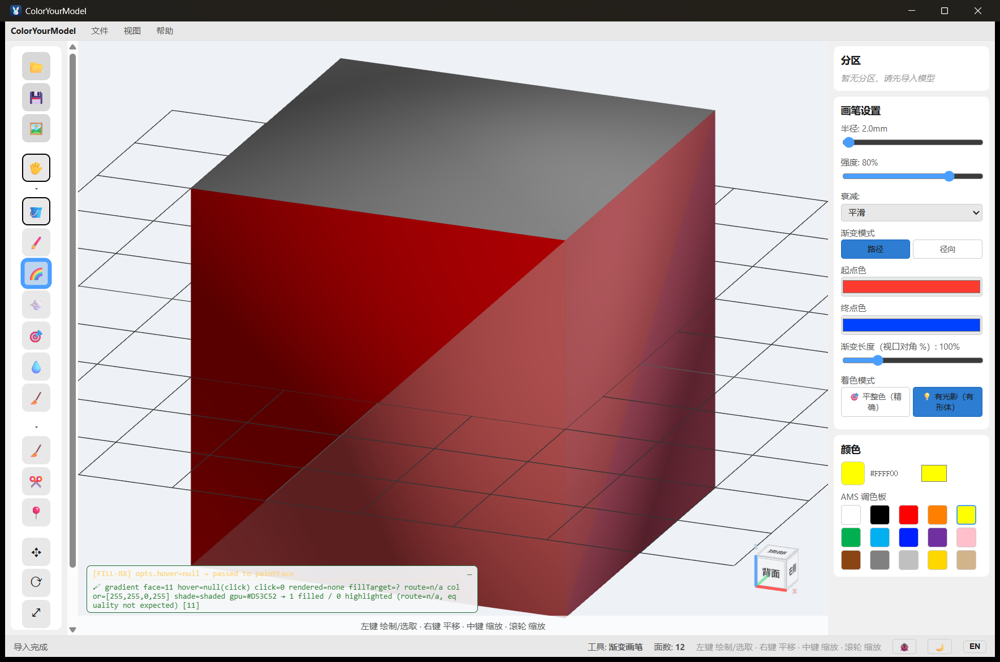
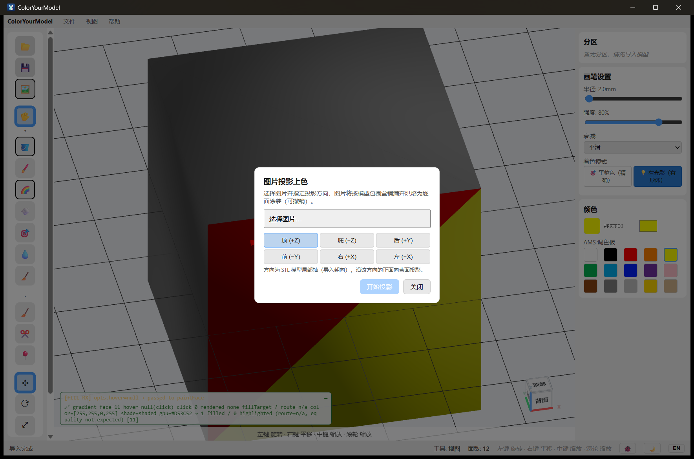
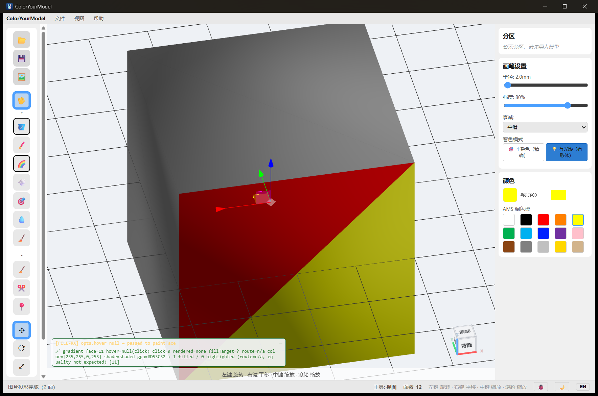
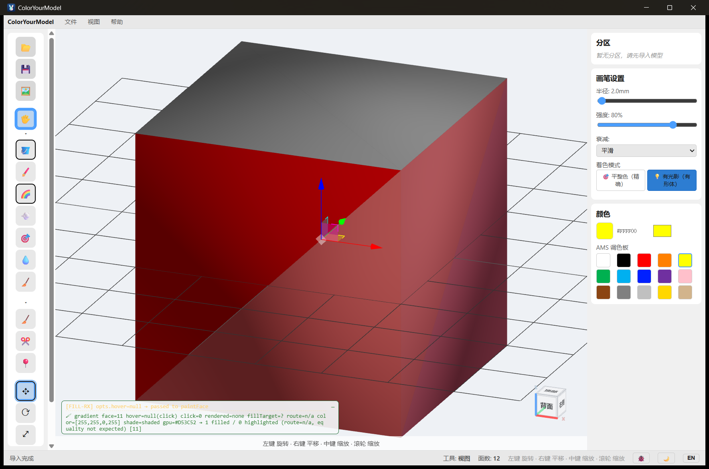
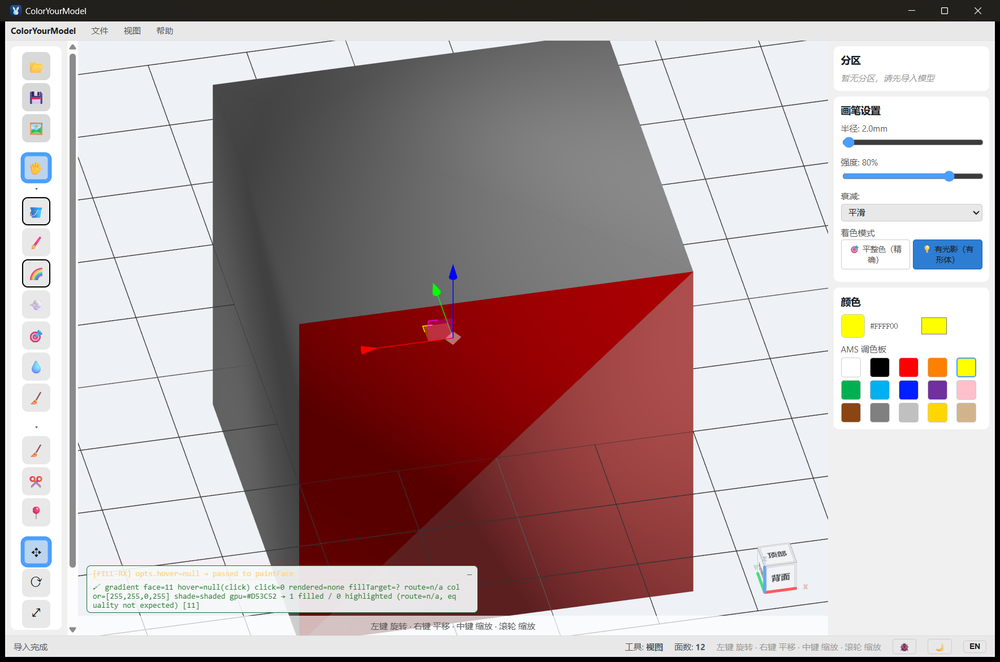

# 画笔进阶：渐变、图片投影与模型变换（0.2.0）

> 0.2.0 新增的四个画笔/模型能力速览：渐变画笔、图片投影上色、模型变换、按颜色分件导出。
> 基础涂色见 [Painting Tools](painting-tools.md)，分区见 [Seed Tools](seed-tools.md)，导出见 [Exporting](exporting.md)。

## 渐变画笔 🌈

工具栏选择 **渐变画笔**，在 **画笔设置** 面板底部会出现渐变专属选项：

- **渐变模式**：路径（沿笔划方向渐变）/ 径向（圆盘内从中心向外渐变）
- **起点色 / 终点色**：两个色块分别对应笔划起点与终点的颜色
- **渐变长度**：路径模式下，颜色跑完整个渐变所需的拖拽距离（视口对角的百分比）

在模型上按住左键拖拽即可：颜色沿笔划从起点色平滑过渡到终点色。

要点：

- 渐变写的是**真实涂装颜色**（与普通画笔同一数据通道），可撤销、可导出
- 拖得越长过渡越慢；**渐变长度** 滑杆控制"跑完全程"所需的距离
- 径向模式按**单击位置**为中心向外渐变（点击一次即完成）

## 图片投影上色 🖼️

工具栏 **🖼 图片投影上色**（或 文件 → 图片投影上色…）：

1. **选择图片**：选一张 PNG/JPG
2. **选方向**：六个按钮对应 STL 模型局部轴（顶/底/前/后/左/右）
3. **开始投影**：图片按模型包围盒铺满，沿该方向"拍"到模型表面，烘焙为逐面涂装

说明：

- 投影会把图片"拉伸"到模型的包围盒上——想控制构图，先用裁剪过的方图
- 背面（背对投影方向的面）不会被涂到；凹模型深处的面可能与正面采到同一像素
- 结果是普通涂装：可继续用其他画笔修改、可撤销、可导出

## 模型变换 ✥ ⟳ ⤢

工具栏底部三个变换按钮：**移动 ✥ / 旋转 ⟳ / 缩放 ⤢**。

- 点击任一按钮，模型中心出现变换 gizmo（箭头=轴，中心方块=平面移动）
- 拖动箭头沿轴移动，拖动中心方块在屏幕平面内自由移动
- **再次点击同一按钮或切换工具即退出变换**（gizmo 消失，变换已固化）
- Ctrl+Z 可撤销整次拖拽；变换后的模型即为导出/保存的真实几何

## 按颜色分件导出（实验）

文件 → **按颜色分件导出…**：把涂装按颜色拆成多个独立 OBJ（每种颜色的连通片一个文件）+ `manifest.txt` 清单，供不支持涂色槽的切片软件（Cura/PrusaSlicer）按件打印。

> ⚠ 实验功能：拆出的是**开放曲面壳**（无封面），部分切片器可能拒绝非水密网格；颜色经 16 槽量化，渐变等连续色会被归并。结论与限制详见 [Split Export Spike](../technical/split-export-spike.md)。

## 工具栏分组

涂色工具与分区工具各自成组，点组分隔处的 **▾/▸** 可折叠/展开——折叠含当前激活工具的分组会被拒绝（避免当前工具"消失"）。
