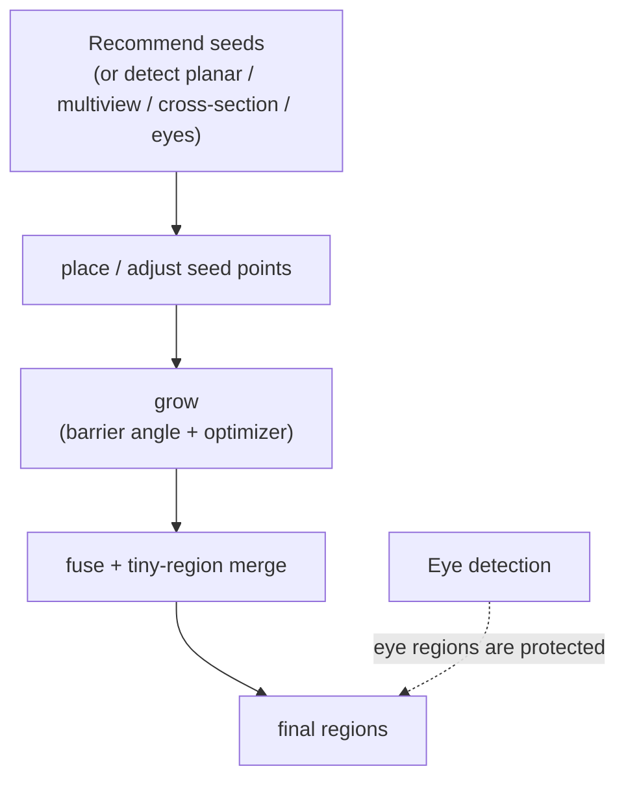

# Seed Tools

> Part of the CYM wiki — seed-based segmentation: place seeds, grow regions, fuse results.
> Internals: [Algorithms: Seed Grow & Fuse](../algorithms/seed-grow-fuse.md).

The **Seed panel** gives fine-grained control on figure-type models where generic auto segmentation needs help. It has two modes:

- **Auto (fuse)** — recommend seeds automatically, grow, then fuse with tiny-region cleanup
- **Manual (grow)** — you place the seeds, the region grows from them

## Seed recommendation

- **Recommended seeds** — saliency-based suggestions with sliders for *count*, *curvature weight* and *concavity weight*.
- **Planar regions** — flat-area detection (angle threshold, distance factor, minimum faces).
- **Multiview** — regions consistently seen from multiple views (view count, angle threshold, minimum faces, match threshold).
- **Cross-section** — features found on slicing planes per axis.
- **Detect eyes** — one click, global scan (no ROI needed); a ROI-mode also exists for developers (see [IPC Reference](../developer/ipc-reference.md)).

Suggestions are cleared automatically before a new eye detection so stale suggestions can't pollute results.

## Growing regions

Each seed grows into a region bounded by the **barrier angle** — adjacent faces whose normals differ more than the barrier stop the growth. Toggle the **optimizer** to post-process the grown regions. Add or move seeds and grow again; regions you keep are preserved.

## Fusing

**Fuse** merges over-seeded fragments, with aggressive **tiny-region merging** (micro-regions are absorbed and a live size breakdown is shown in the status area) and a reverse-split guard against runaway merges. Eye regions detected earlier are protected — they survive internal cuts and merges.

## When to use what

| Situation | Suggestion |
|-----------|------------|
| Figure with eyes/face | Detect eyes first, then seed-grow the body parts |
| Mechanical part | Skip seeds — dihedral auto segmentation is enough |
| Auto result too fragmented | Fuse with tiny-region merge |
| One region wrong | Resegment just that region (Segments panel) instead of re-running everything |
