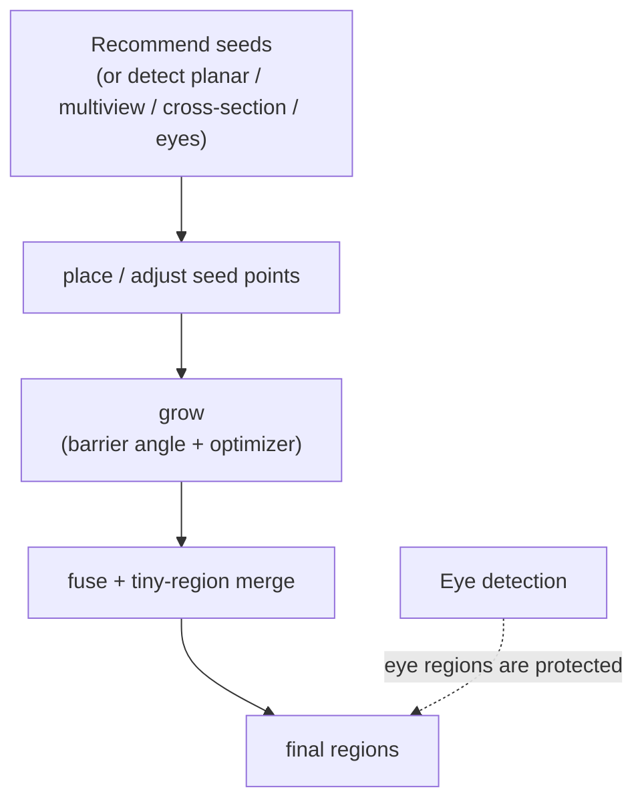

# Seed Tools

> Part of the CYM wiki — seed-based segmentation: place seeds, grow regions, fuse results.
> Internals: [Algorithms: Seed Grow & Fuse](../algorithms/seed-grow-fuse.md).

Seeds → fuse → export, end to end:

<video controls width="640" src="https://github.com/ZackaryShen/ColorYourModel/releases/download/media/partition-and-export-demo.mp4"></video>

The **Seed panel** gives fine-grained control on figure-type models where generic auto segmentation needs help. It has two modes:

- **Auto (fuse)** — recommend seeds automatically, grow, then fuse with tiny-region cleanup
- **Manual (grow)** — you place the seeds, the region grows from them

## Seed recommendation

- **Recommended seeds** — saliency-based suggestions with sliders for *count*, *curvature weight* and *concavity weight*.
- **Planar regions** — flat-area detection (angle threshold, distance factor, minimum faces).
- **Multiview** — regions consistently seen from multiple views (view count, angle threshold, minimum faces, match threshold).
- **Cross-section** — features found on slicing planes per axis.
- **Detect eyes** — one click, global scan (no ROI needed); a ROI-mode also exists for developers (see [IPC Reference](../developer/ipc-reference.md)).

Suggestions are cleared automatically before a new eye detection so stale suggestions can't pollute results.

## Growing regions

Each seed grows into a region bounded by the **barrier angle** — adjacent faces whose normals differ more than the barrier stop the growth. Toggle the **optimizer** to post-process the grown regions. Add or move seeds and grow again; regions you keep are preserved.

## Fusing

**Fuse** merges over-seeded fragments, with aggressive **tiny-region merging** (micro-regions are absorbed and a live size breakdown is shown in the status area) and a reverse-split guard against runaway merges. Eye regions detected earlier are protected — they survive internal cuts and merges.

### The fold-angle threshold

The **Dihedral °** slider (0–35°, default **2°**) controls where the partition
is allowed to cut. Lower = finer, higher = coarser:

| Model class | Suggested value | Why |
|-------------|-----------------|-----|
| Sculpted figures (creatures, busts, anime figures) | **0–3°** | Sculpted part folds (neck, shoulders, hips) spread their turning over many sub-5° edges; only a low threshold lets the fuse separate head / limbs / tail |
| Hard-surface parts (signs, kiosks, architectural) | **5–15°** | Sharp creases cut themselves; a higher threshold keeps flat walls whole |

Pressing **Fuse & generate** runs a staged pipeline with a live progress bar:
planar detection → multi-view evidence → fold-angle backbone → edge vote.

### Adjacent regions never share a colour

The viewport colours each region by its label. The fuse allocates labels so
that **touching regions always land on different palette slots** (greedy
graph colouring over the region adjacency, 30-slot palette) — two neighbouring
regions can safely look at each other without reading as one blob.

## Lasso regions

For the areas where geometry has no boundary to offer (a smooth cheek, a flat
wall band), draw a region by hand with the **Lasso** tool: click points around
the area, then click near the start point (or press Enter) to close.

Closing the loop shows the same progress bar — snap → boundary completion →
region capture → smoothing → commit — because on million-face meshes every one
of those stages is real work. The boundary between clicked points follows the
mesh surface (A* shortest path), so the outline hugs the geometry instead of
cutting through it.

## When to use what

| Situation | Suggestion |
|-----------|------------|
| Figure with eyes/face | Detect eyes first, then fuse; lasso anything the vote missed |
| Sculpted figure, one giant region | Lower the fold threshold toward 0–2° and fuse again |
| Mechanical part | Skip seeds — dihedral auto segmentation is enough |
| Auto result too fragmented | Fuse with tiny-region merge, or raise the fold threshold |
| One region wrong | Resegment just that region (Segments panel) instead of re-running everything |
| Smooth area with no crease | Geometry has no boundary there — lasso it |

Real runs of every case above live in the [Examples Gallery](../cases/examples.md).
